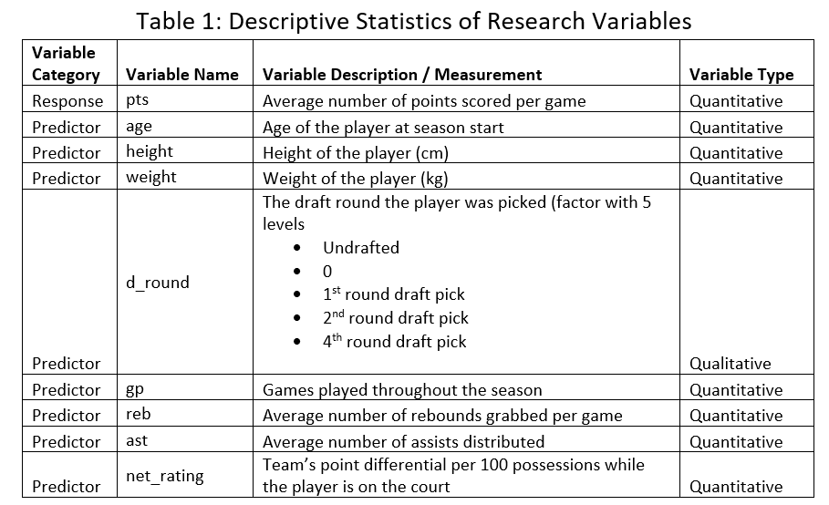

```{r setup, include=FALSE}
knitr::opts_chunk$set(echo = TRUE)
```

# Chapter 1: Introduction

We are doing our study on modeling the National Basketball Association (NBA) player stats.

A little background info on the NBA, it's a basketball league that has seasons running from October of a year to April of the next year, with each team playing 82 games. Teams are made up of many players. Each player can score points for their team, and at the end of a game, the team with the most points win the game.[NBA, 2021]

The objective of our study is to create a Multiple Linear Regression model for modeling points per game of an NBA player in a particular season where the player played 10 or more regular season games based on several independent variables, we will describe those variables in more detail in the Methodology section below.

Our research questions are: 

1.	Do player attributes during a particular season affect a player’s points per game stat for that season? Specifically, their age, height, and weight at the start of the season
2.	Do other box score statistics from the season affect a player’s points per game stat for that season? Specifically, total games played in a season, assists per game, rebounds per game, and net rating per game
3.	Does which round the player get drafted in the NBA draft affect the player's points per game stat?

We expect to find that at least some of the variables will affect the players points per game stat.

##  Topic Importance

This topic is important to our group because we recognize that sports analytics is an important area of application for statistical analysis and modeling. We want learn and gain some experience in statistical analysis and model building in sports analytics. 

## Data sources

The data is sourced from Kaggle.com, it is an open dataset related to basketball data with public license [Kaggle, 2021] and contains the per season stats per NBA player from 1996 season all the way up to 2021 season. The specific columns of the dataset that we will be using will be described in more detail in the Methodology section below. We plan to use the data from the 10 seasons that is between 2010-2020 seasons for our model building. Our population and sample are defined as per follows: 

*	we define our population as NBA players in any season that plays 10 or more games in a season 
*	we define our sample as NBA players from the 10 seasons between 2010-2020 who have played 10 or more games in a season  (sample size of 4,473 after some data wrangling)

Please note that during our project checkpoint, we originally proposed to do our project on an Life Expectancy data set. However, we had to switch our topic / dataset to the current one after we found that the Life Expectancy data set was of terrible quality (lots of missing data and more importantly, lots of erroneous data).


# Chapter 2: Methodology

## Descriptive Statistics

```{r, out.width = '90%', echo = FALSE}

```


## Project Plan

Project plan and all methods for modelling:

1)	Create best first order model
    a.	Create a full model with response variable and all predictor variables, conduct individual t-test to identify significant predictors
    b.	Complete All-Possible-Regressions Selection Procedure [ols_step_best() function] and interpret Cp, AIC, Adjusted R2, and R2 numerical results and plots to identify the best possible predictors.
    c.	Calculate Stepwise model to identify significant variables (pent = 0.05, prem = 0.1)
    d.	Calculate Forward model to identify significant variables (pent = 0.05)
    e.	Calculate Backward model to identify significant variables (prem = 0.05)
    f.	Compare all models, identify the best predictors based on highest R2adj and lowest RMSE and comparing All-Possible-Regression predictors.

2)	Create the reduced first order model and complete Partial F test to validate that dropping the selected predictors was correct.

3)	Test for multicollinearity across the selected predictors in the reduced first order model, remove variables with high VIF if present.

4)	Check for interactions across variables and identify the interaction model with only significant interactions remaining. Complete Partial F test to verify dropping all the selected interactions simultaneously is correct.

5)	Use ggplot to check correlation and identify potential variables that benefit from being higher order (correlations ~0.5 or greater)

6)	Create a higher order model on the high correlation variables using the poly() function, leaving only significant higher order terms

7)	Remove insignificant interactions from the model, verify dropping them simultaneously is correct using Partial F test

8)	Complete model diagnostics
    a.	Linearity assumption check (Residual vs. Fitted plot)
    b.	Equal Variance assumption check 
        i. Residual vs Fitted Values plot
        ii. Scale-Location Plot: Standardized Residual vs Fitted Values
        iii.	Breusch-Pagan test
    c.	Normality assumption check
        i. Residual vs Fitted Values plot
        ii. Interpret Histogram of Residuals
        iii.	Shapiro-Wilk test
    d.	Identify Outliers (and if they are significant)
        i.	Residual vs. Leverage plot
        ii.	Cook’s Distance plot
        iii.	Leverage points at 2p/n & 3p/n, check the model with influential points removed to see if it makes it better by comparing R2adj and RMSE. Check data points manually to see if they look like typo's or errors.

9)	If the model fails Equal Variance or Normality assumptions, complete Box-Cox transformation
    a.	Redo model assumption tests to see if the model meets assumptions
    b.  If there are insignificant interactions after transform, drop them and verify.

10)	State best final model and interpret

11)	Test prediction of the model by supplying test data based on real NBA player scores!

# Chapter 3: Main Results of the Analysis

## Data Wrangling

```{r, include = FALSE}
# install.packages("ggplot2")
library(ggplot2) #using ggplot2 for data visualization # for heteroscedasticity
# install.packages("olsrr")
library(olsrr) #need to install the package olsrr # for stepwise, forward, backward
# install.packages("GGally")
library(GGally) # need to install the GGally package for ggpairs function # for linearity
library(mctest) #for VIF
library(car) #for VIF
library(lmtest) # for heteroscedasticity
library(leaps) # for best.subset() function
library(Ecdat)#for dataset University
library(MASS) #for the boxcox()function
library(agricolae)# SNK.test() is avalible in the agricolae package for Newman-Keuls
library(dplyr) # for filter function

```

```{r}
# import data
bb_raw=read.csv("all_seasons.csv",header=TRUE)
# shorten the column names
colnames(bb_raw)<- c("X", "player_name","team_abbrev","age","height",
                     "weight","college","country","d_year","d_round",
                     "d_number","gp","pts","reb","ast","net_rating","oreb_pct",
                     "dreb_pct","usg_pct","ts_pct","ast_pct","season")
# shorten the "Undrafted" values under the draft related columns to "U"
bb_raw["d_year"][bb_raw["d_year"] == "Undrafted"] <- "U"
bb_raw["d_round"][bb_raw["d_round"] == "Undrafted"] <- "U"
bb_raw["d_number"][bb_raw["d_number"] == "Undrafted"] <- "U"
head(bb_raw)
colnames(bb_raw)

# remove null, filter to only include seasons the 10 seasons between 2010-2020
# this is to limit our analysis to recent seasons and limit 
nrow(bb_raw)
bb <- na.omit(bb_raw)
# filter out players who have played less than 10 games in a particular season
bb = filter(bb, gp >= 10)
nrow(bb)
# we define our population as players in any season that plays 10 or more games in a season
# we define our sample as players from the 10 seasons between 2010 and 2020 
# who have played 10 or more games in a season
bb = filter(bb, (season=='2010-11'|season=='2011-12'|season=='2012-13'
                 |season=='2013-14'|season=='2014-15'|season=='2015-16'
                 |season=='2016-17'|season=='2017-18'|season=='2018-19'
                 |season=='2019-20'))
nrow(bb)
```


## First Order Model

```{r}
fullmodel<-lm(pts~age+height+weight+factor(d_round)+gp+reb+ast+net_rating, data = bb)
summary(fullmodel)


nomodel<-lm(pts~1, data = bb)
# check to see if at least one variable is significant
anova(nomodel, fullmodel)

# Partial F test - we test to see if any of the variables are significant

# Ho: B1 = B2 = .... = Bi = o
# Ha: at least one Bi != 0

# we confirm that at least 1 variable is significant because we have p-values < 0.05,
# meaning we reject the null hypothesis. 

# check to see if there are aliases in the model, remove alias if needed
alias(fullmodel)

# Start model selection
# All-Possible-Regressions Selection Procedure
#Model selection by exhaustive search, forward or backward stepwise, or sequential
ks=ols_step_best_subset(fullmodel, details=TRUE)
# for the output interpretation
cp<-c(ks$cp)
rsquare<-c(ks$rsq)
AIC<-c(ks$aic)
AdjustedR<-c(ks$adjr)
cbind(cp,rsquare,AIC,AdjustedR)
par(mfrow=c(2,2)) # split the plotting panel into a 2 x 2 grid
plot(ks$cp,type = "o",pch=10, xlab="Number of Variables",ylab= "Cp")
plot(ks$rsq,type = "o",pch=10, xlab="Number of Variables",ylab= "R^2")
#plot(ks$rss, xlab="Number of Variables",ylab= "RMSE")
plot(ks$aic,type = "o",pch=10, xlab="Number of Variables",ylab= "AIC")
plot(ks$adjr,type = "o",pch=10, xlab="Number of Variables",ylab= "Adjusted R^2")
par(mfrow=c(1,1)) # change the plotting panel back into a 1 x 1 grid

# we can see that model with 8 variables has the lowest AIC, CP
# and the model with 7 variables has the highest the R^2, R^2_adj 
# and the values are all very close between the 7 variable and 8 variable models
# so in this case, we decide to defer to Mallows’s Cp Criterion, 
# and choose a small cp value that is also close to p +1
# as that is a property that indicates that slight (or no) bias exists in 
# the subset regression model.
# for model with 7 variables, p+1=8, Cp = 7.363052
# for model with 8 variables, p+1=9, Cp = 6.000000
# we can see that the model with 7 variables has p+1 most near to it's Cp
# so we'll go with a 7 variable model

# build model with stepwise, backward, forward methods
stepw=ols_step_both_p(fullmodel,pent = 0.05, prem = 0.1, details=FALSE)
backmodel=ols_step_backward_p(fullmodel, prem = 0.05, details=FALSE)
formodel=ols_step_forward_p(fullmodel, penter = 0.05, details=FALSE)
summary(fullmodel)
summary(stepw$model)
summary(backmodel$model)
summary(formodel$model)

# full model significant variables (individual t test)
# age, height, d_round, gp, reb, ast, net_rating

# stepwise model significant variables
# age, height, d_round, gp, reb, ast, net_rating

# forward model significant variables
# age, height, d_round, gp, reb, ast, net_rating

# backward model significant variables
# age, height, d_round, gp, reb, ast, net_rating


# build reduced model based on our All-Possible-Regressions Selection Procedure,
# Individual t-test, stepwise, forward, backward (all recommends 7 variables model)

# Complete partial F test to validate that dropping all but 7 variables
# is statistically significant

# Ho: Beta_weight = 0 (Beta's corresponding to weight, )
# Ha: Beta_weight != 0

reducedmodel<-lm(pts~age+height+factor(d_round)+gp+reb+ast+net_rating, data = bb)
summary(reducedmodel)
anova(reducedmodel, fullmodel)

# The Partial F test gives a p-value = 0.06674 > alpha = 0.05, therefore we fail
# to reject Ho and conclude the weight variable should be dropped from the model
```

## Multicollinearity

```{r}
# test for multicollinearity
vif(reducedmodel)

```

The VIF output concludes that there are no statistically significant variables with multicollinearity because all VIF values are <3.

## Interactions between variables

```{r}
# check for interaction and revise models
interacmodel<-lm(pts~(age+height+factor(d_round)+gp+reb+ast+net_rating)^2, data = bb)
summary(interacmodel)

# reduce model by taking out insignificant interactions terms
reducedmodel2<-lm(pts~age+height+factor(d_round)+gp+reb+ast+net_rating
                  +age:factor(d_round)+age:ast
                  +height:factor(d_round)+height:reb+height:ast
                  +factor(d_round):reb+factor(d_round):ast
                  +gp:reb+reb:ast+reb:net_rating+ast:net_rating
                  ,data = bb)
summary(reducedmodel2)
anova(reducedmodel2, interacmodel)

# Partial F test on interacmodel (all possible interactions) and 
# reducedmodel2 with insignificant interactions removed.

# Ho: B1 = B2 = .... = Bi = o
# Ha: at least one Bi != 0

# The Partial F test gives a p-value = 0.001788 <alpha = 0.05, therefore we 
# reject Ho and conclude that we shouldn't have simultaneously dropped all
# of the interactions from the model that we did.


# this reduction is no good, we took out a significant term, 
# put back the term with the next lowest p value from the individual t test 
# of the full interaction model
# and that's age:height with a p-value of 0.078388

reducedmodel3<-lm(pts~age+height+factor(d_round)+gp+reb+ast+net_rating
                  +age:height+age:factor(d_round)+age:ast
                  +height:factor(d_round)+height:reb+height:ast
                  +factor(d_round):reb+factor(d_round):ast
                  +gp:reb+reb:ast+reb:net_rating+ast:net_rating
                  ,data = bb)
summary(reducedmodel3)
anova(reducedmodel3, interacmodel)

# Partial F test on interac model (all possible interactions) and 
# reducedmodel3 with insignificant interactions removed.

# Ho: B1 = B2 = .... = Bi = o
# Ha: at least one Bi != 0

# The Partial F test gives a p-value = 0.05142 > alpha = 0.05, therefore we fail
# to reject Ho and conclude all that we should have simultaneously dropped all
#  of the interactions from the model that we did.
```

## Higher order variables & further insigificant interactions

```{r}

# check for need of higher order model
# gg pairs plot
pairsdf <-data.frame(bb$pts,bb$age,bb$height,bb$d_round,bb$gp,bb$reb,bb$ast,bb$net_rating)

ggpairs(pairsdf,lower = list(continuous = "smooth_loess", combo =
                               "facethist", discrete = "facetbar", na = "na")) 

# get best higher order models, try gp, reb, ast,  because they have
# correlation values that are close to 0.5 or greater
highermodel<-lm(pts~age+height+factor(d_round)+gp+reb+ast+net_rating
                +age:height+age:factor(d_round)+age:ast
                +height:factor(d_round)+height:reb+height:ast
                +factor(d_round):reb+factor(d_round):ast
                +gp:reb+reb:ast+reb:net_rating+ast:net_rating
                +poly(ast,2,raw=TRUE)+poly(reb,2,raw=TRUE)+poly(gp,2,raw=TRUE)
                ,data = bb)
summary(highermodel)

anova(reducedmodel3,highermodel)

# Partial F test on reducedmodel3 (best first order model with interactions) and
# highermodel (adding 2 higher order terms simultaneously)

# Ho: Beta_ast^2 = Beta_reb^2 = 0 (Beta's associated with higher order)
# Ha: at least one Beta_i != 0

# The Partial F test gives a p-value = 2.2e-16 < alpha = 0.05, therefore we
# reject Ho and conclude all adding the two higher order terms is correct.


# the higher order term for gp is insignificant, we'll take that out
highermodel2<-lm(pts~age+height+factor(d_round)+gp+reb+ast+net_rating
                 +age:height+age:factor(d_round)+age:ast
                 +height:factor(d_round)+height:reb+height:ast
                 +factor(d_round):reb+factor(d_round):ast
                 +gp:reb+reb:ast+reb:net_rating+ast:net_rating
                 +poly(ast,2,raw=TRUE)+poly(reb,2,raw=TRUE)
                 ,data = bb)
summary(highermodel2)

# we note that the interaction term (reb*ast) became insignificant, 
# since no higher order term depends on that interaction term
# we remove that and test with anova() to see if that is indeed insignificant and can be removed
reducedmodel4<-lm(pts~age+height+factor(d_round)+gp+reb+ast+net_rating
                  +age:height+age:factor(d_round)+age:ast
                  +height:factor(d_round)+height:reb+height:ast
                  +factor(d_round):reb+factor(d_round):ast
                  +gp:reb+reb:net_rating+ast:net_rating
                  +poly(ast,2,raw=TRUE)+poly(reb,2,raw=TRUE)
                  ,data = bb)
summary(reducedmodel4)
anova(reducedmodel4, highermodel2)

# Partial F test on highermodel2 (higher order model with interactions) and 
# reducedmodel4 (higher order model with reb:ast interaction removed)

# Ho: Beta_reb:ast = 0
# Ha: Beta_reb:ast != 0

# The Partial F test gives a p-value = 0.1059 > alpha = 0.05, therefore we fail
# to reject Ho and conclude that we should have dropped the reb:ast
# interaction from the model.
# Note: the individual t test from summary() would have done the trick as well

# we try even higher order terms, specifically ast^3 and then reb^3, 
highermodel3<-lm(pts~age+height+factor(d_round)+gp+reb+ast+net_rating
                 +age:height+age:factor(d_round)+age:ast
                 +height:factor(d_round)+height:reb+height:ast
                 +factor(d_round):reb+factor(d_round):ast+gp:reb
                 +reb:ast+reb:net_rating+ast:net_rating
                 +poly(ast,3,raw=TRUE)+poly(reb,2,raw=TRUE)
                 ,data = bb)
summary(highermodel3)
# the higher orders terms with ast were insignificant based on individual
# t-test p-value = 0.580812 > alpha = 0.05 for ast^3

# we now try reb^3, 
highermodel4<-lm(pts~age+height+factor(d_round)+gp+reb+ast+net_rating
                 +age:height+age:factor(d_round)+age:ast
                 +height:factor(d_round)+height:reb+height:ast
                 +factor(d_round):reb+factor(d_round):ast+gp:reb
                 +reb:ast+reb:net_rating+ast:net_rating
                 +poly(ast,2,raw=TRUE)+poly(reb,3,raw=TRUE)
                 ,data = bb)
summary(highermodel4)

# the higher orders terms with ast were insignificant based on individual
# t-test p-value = 0.074991 > alpha = 0.05 for reb^3

# We conclude that the best model so far is the one with reb^2 and ast^2 for
# higher order.
bestmodelsofar = reducedmodel4
```


## Model Diagnostics

```{r}
# Check Linearity Assumption
ggplot(bestmodelsofar, aes(x=.fitted, y=.resid)) +
geom_point() +
geom_hline(yintercept = 0) +
geom_smooth()+
ggtitle("Residual plot: Residual vs Fitted values")

# Linearity Assumption Conclusion:
# The Residual vs. Fitted plot shows a clear and distinct straight line
# We conclude that the linearity assumption is met.

# Check Equal Variance Assumption
ggplot(bestmodelsofar, aes(x=.fitted, y=sqrt(abs(.stdresid)))) +
geom_point() +
geom_hline(yintercept = 0) +
geom_smooth()+
ggtitle("Scale-Location plot : Standardized Residual vs Fitted values")

# Breusch-Pagan test (for equal variance)
# Ho: heteroscedasticity is not present (homoscedasticity)
# Ha: heteroscedasticity is present

bptest(bestmodelsofar)

# Equal Variance Assumption Conclusion:
# The Residual vs Fitted plot clearly shows a funnel shape, hinting that 
# equal variance assumption is not met
# The Scale-Location plot shows a slight funnel shape, but it is hardly
# noticable
# The Breush-Pagan test returns a p-value = 2.2e-16 < alpha = 0.05, strongly
# concluding that the equal variance assumption is not met.


# Check Normality Assumption - histogram and qq plot and Shapiro wilk
qplot(residuals(bestmodelsofar),
geom="histogram",
binwidth = 0.1,
main = "Histogram of residuals",
xlab = "residuals", color="red",
fill=I("blue"))

plot(bestmodelsofar, which=2)

#test normality with Shapiro-Wilk test
#Ho: the sample data are significantly normally distributed
#Ha: the sample data are not significantly normally distributed

shapiro.test(residuals(bestmodelsofar))

# Normality Assumption Conclusion:
# The histogram does hint the normality assumption is met, however, there does
# appear to be multiple peaks and some skewness

# The Normal Q-Q plot shows significant deviation from the diagonal line at 
# both tails

# The Shapiro-Wilks test returns a p-value = 2.2e-16 < alpha 0.05, strongly
# concluding that the Normality assumption is not met.


```

## Outliers Check

```{r}
# outliers
# 1. Residuals vs Leverage plot
plot(bestmodelsofar,which=5)

# 2. Cook’s Distance
bb[cooks.distance(bestmodelsofar)>0.5,]
plot(bestmodelsofar,pch=18,col="red",which=c(4))

# 3. Leverage points
lev=hatvalues(bestmodelsofar)
p = length(coef(bestmodelsofar))
n = nrow(bb)
outlier = lev[lev>(2*p/n)]
print(outlier)
outliers_2p_over_n = strtoi(names(outlier))
outlier = lev[lev>(3*p/n)]
print(outlier)
outliers_3p_over_n = strtoi(names(outlier))

      
plot(rownames(bb),lev, main = "Leverage in BBall Dataset",
xlab="observation",ylab = "Leverage Value")
abline(h = 2 *p/n, lty = 1)
abline(h = 3 *p/n, lty = 1)

nrow(bb)

# remove outliers for 3p/n remodel based on reducedmodel3
outlier_removed_data3pn <- bb[-c(outliers_3p_over_n), ]
nrow(outlier_removed_data3pn)


outlier_removed_model1<-lm(bestmodelsofar$call$formula
                  ,data = outlier_removed_data3pn)
summary(outlier_removed_model1)

# remove outliers for 2p/n remodel based on reducedmodel3
outlier_removed_data2pn <- bb[-c(outliers_2p_over_n), ]
nrow(outlier_removed_data2pn)
outlier_removed_model2<-lm(bestmodelsofar$call$formula
                  ,data = outlier_removed_data2pn)
summary(outlier_removed_model2)

# these models produced lower RMSE but also lower R^2_adj, 
# so its inconclusive whether they are better, 
# by checking our data manually, we noticed that at h_i > 3p/n
# a couple of erronious data were removed (d_round = 0 and d_round = 4)
# and at h_i > 2p/n, no additional bad data were removed, 
# so we use the outlier_removed_model1, that is where h_i > 3p/n

# we reduce outlier_removed_model1 by taking out insignificant terms 
# which are age:factor(d_round) and second order term for reb
reducedmodel5<-lm(pts~age+height+factor(d_round)+gp+reb+ast+net_rating
                  +age:height+age:ast
                  +height:factor(d_round)+height:reb+height:ast
                  +factor(d_round):reb+factor(d_round):ast
                  +gp:reb+reb:net_rating+ast:net_rating
                  +poly(ast,2,raw=TRUE)
                  ,data = outlier_removed_data3pn)
summary(reducedmodel5)
anova(reducedmodel5, outlier_removed_model1)

# Partial F test on outlier_removed_model1 (reducedmodel4 with high leverage
# data points removed) and reducedmodel5 (reducedmodel4 with high leverage data
# points removed, age:factor(d_round) interaction removed, and reb^2 removed)

# Ho: Beta_age:factor(d_round) = Beta_reb^2 = 0
# Ha: Beta_age:factor(d_round) = Beta_reb^2 != 0

# The Partial F test gives a p-value = 0.1542 > alpha = 0.05, therefore we fail
# to reject Ho and conclude that we should have dropped the
# age:factor(d_round) interaction and reb^2 variables from the model.


# we continue reduce reducedmodel5 by taking out insignificant terms 
# which is reb:net_rating
reducedmodel6<-lm(pts~age+height+factor(d_round)+gp+reb+ast+net_rating
                  +age:height+age:ast
                  +height:factor(d_round)+height:reb+height:ast
                  +factor(d_round):reb+factor(d_round):ast
                  +gp:reb+ast:net_rating
                  +poly(ast,2,raw=TRUE)
                  ,data = outlier_removed_data3pn)
summary(reducedmodel6)
anova(reducedmodel6, reducedmodel5)

# Partial F test on reducedmodel5 and 
# reducedmodel6 (reducedmodel5 with reb:net_rating interaction removed)

# Ho: Beta_reb:net_rating = 0
# Ha: Beta_reb:net_rating != 0

# The Partial F test gives a p-value = 0.05377   > alpha = 0.05, therefore we fail
# to reject Ho and conclude that we should have dropped the
# reb:net_rating interaction variable from the model.

# we continue reduce reducedmodel6 by taking out insignificant terms 
# which is height:factor(d_round)
reducedmodel7<-lm(pts~age+height+factor(d_round)+gp+reb+ast+net_rating
                  +age:height+age:ast
                  +height:reb+height:ast
                  +factor(d_round):reb+factor(d_round):ast
                  +gp:reb+ast:net_rating
                  +poly(ast,2,raw=TRUE)
                  ,data = outlier_removed_data3pn)
summary(reducedmodel7)
anova(reducedmodel7, reducedmodel6)

# Partial F test on reducedmodel6 and reducedmodel7 (reducedmodel6 with
# height:factor(d_round) interaction removed)

# Ho: Beta_reb:height:factor(d_round) = 0
# Ha: Beta_reb:height:factor(d_round) != 0

# The Partial F test gives a p-value = 0.1292   < alpha = 0.05, therefore we
# fail to reject Ho and conclude that we should have dropped the
# height:factor(d_round) interaction variable from the model.

# we will use reducedmodel7

bestmodelsofar = reducedmodel7

```

## Box-Cox Transformation

```{r}
# Box-Cox
bc=boxcox(bestmodelsofar,lambda=seq(-1,1))
#extract best lambda
bestlambda=bc$x[which(bc$y==max(bc$y))]
print(bestlambda)

bcmodel=lm((((pts^bestlambda)-1)/bestlambda)~age+height+factor(d_round)
           +gp+reb+ast+net_rating
           +age:height+age:ast
           +height:reb+height:ast
           +factor(d_round):reb+factor(d_round):ast
           +gp:reb+ast:net_rating
           +poly(ast,2,raw=TRUE)
           ,data = outlier_removed_data3pn)

summary(bcmodel)
# bcmodel has the highest r-squared adjusted and lowest RMSE, it is the best model so far

# factor(d_round):reb becomes insignificant as shown in the individual t test, 
# we take that out and do f-test to make sure
reducedbcmodel=lm((((pts^bestlambda)-1)/bestlambda)~age+height+factor(d_round)
                  +gp+reb+ast+net_rating
                  +age:height+age:ast
                  +height:reb+height:ast
                  +factor(d_round):ast
                  +gp:reb+ast:net_rating
                  +poly(ast,2,raw=TRUE)
                  ,data = outlier_removed_data3pn)
summary(reducedbcmodel)
anova(reducedbcmodel, bcmodel)
# f test shows that it's good to remove that interaction

# Partial F test on bcmodel (Box-Cox transformed model) and 
# reducedbcmodel (Box-Cox transformed model with factor(d_round):reb interaction dropped)

# Ho: Beta_factor(d_round):reb = 0
# Ha: Beta_factor(d_round):reb != 0

# The Partial F test gives a p-value = 0.6796 > alpha = 0.05, therefore we fail
# to reject Ho and conclude all that we should have dropped the factor(d_round):reb
# interaction from the model.
# all good with taking that out

bestmodelsofar = reducedbcmodel

```

## Model Diagnostics on Box-Cox Transform model

```{r}

# Linearity Assumption check
ggplot(bestmodelsofar, aes(x=.fitted, y=.resid)) +
geom_point() +
geom_hline(yintercept = 0) +
geom_smooth()+
ggtitle("Residual plot: Residual vs Fitted values")

# Linearity Assumption Conclusion:
# The Residual vs. Fitted plot shows a straight line, meaning
# the linearity assumption is met.

# Equal Variance Assumption Check
ggplot(bestmodelsofar, aes(x=.fitted, y=sqrt(abs(.stdresid)))) +
geom_point() +
geom_hline(yintercept = 0) +
geom_smooth()+
ggtitle("Scale-Location plot : Standardized Residual vs Fitted values")

# Breusch-Pagan test (for equal variance)
# Ho: heteroscedasticity is not present (homoscedasticity)
# Ha: heteroscedasticity is present
bptest(bestmodelsofar)

# Equal Variance Assumption Conclusion:
# The Residual vs. Fitted and Scale-Location plot both don't show any
# evidence of a pattern, hinting that the Equal Variance assumption is met.
# However, the Breusch-Pagan test returns a p-value = 2.2e-16 < alpha = 0.05,
# strongly concluding that the Equal Variance assumption is not met.

# Check Normality Assumption - histogram and qq plot and Shapiro wilk
qplot(residuals(bestmodelsofar),
geom="histogram",
binwidth = 0.1,
main = "Histogram of residuals",
xlab = "residuals", color="red",
fill=I("blue"))

plot(bestmodelsofar, which=2)

#test normality with Shapiro-Wilk test
#Ho: the sample data are significantly normally distributed
#Ha: the sample data are not significantly normally distributed

shapiro.test(residuals(bestmodelsofar))

# Normality Assumption Conclusion:
# The histogram does hint the normality assumption is met and definitely shows
# improvement over the untransformed model. 

# The Normal Q-Q plot shows significant improvement that strongly lines up
# along the diagonal line with no hint of S-shape or bow-shape, hinting that
# normality is met.

# The Shapiro-Wilks test returns a p-value = 0.001681 < alpha 0.05,concluding 
# that the Normality assumption is not met. It is important to note that the
# Box-Cox transform we applied did significantly improve the Shapiro-Wilk
# test p-value, increasing from 2.2e-16 (untransformed model) 
# to 0.001681 (Box-Cox transformed model)

```

## Final Model & Predictive Tests

``` {r}
# final models
finalmodel = bestmodelsofar
summary(finalmodel)


# function to invert Box-Cox transformation
# reference: https://stat.ethz.ch/pipermail/r-help/2007-June/134480.html
invBoxCox <- function(x, lambda)
    		if (lambda == 0) exp(x) else (lambda*x + 1)^(1/lambda)


# try to use the model to predict 3 players's performence in the last season (2020-21 season)
# because we did not use that season's data for training the model, we will use it to test

# Tests
# 1st player is LeBron James, an older player, very good at every aspect of the game
# 2nd player is Stephen Curry, the player with the most points per game in the 2020-21 season
# 3rd player is Fred VanVleet, a player that showed a lot of improvement in the 2020-21 season
# 4th player is James Wiseman, new player, big man, was the 2nd overall pick in the 2020 draft
# 5th player is Tristan Thompson, a Canadian player, average in scoring points, good rebounder

# attempt to predict LeBron James's Points Score Per Game for the 2020-21 season
player_interested = 'LeBron James'
season_interested = '2020-21'
queriedvalues = filter((filter(bb_raw, season==season_interested)), 
                              player_name==player_interested)
pred=predict.lm(finalmodel, 
                newdata=queriedvalues, 
                level=0.95, interval="prediction") 

point_est = invBoxCox(pred[1], bestlambda)
low_est= invBoxCox(pred[2], bestlambda)
high_est= invBoxCox(pred[3], bestlambda)

cat('Model Testing: \nPlayer Name:', player_interested,'\nSeason:',season_interested,
    '\nPoints Per Game, 95% prediction interval:(', 
    round(low_est, digits = 4), ', ', round(high_est, digits = 4), ') ', 
    '\nPoints Per Game, point prediction:', round(point_est, digits = 4), 
    '\nPoints Per Game, actual:', round(queriedvalues$pts, digits = 4), '\n')

# attempt to predict Stephen Curry's Points Score Per Game for the 2020-2021 season
player_interested = 'Stephen Curry'
season_interested = '2020-21'
queriedvalues = filter((filter(bb_raw, season==season_interested)), 
                              player_name==player_interested)
pred=predict.lm(finalmodel, 
                newdata=queriedvalues, 
                level=0.95, interval="prediction") 

point_est = invBoxCox(pred[1], bestlambda)
low_est= invBoxCox(pred[2], bestlambda)
high_est= invBoxCox(pred[3], bestlambda)

cat('Model Testing: \nPlayer Name:', player_interested,'\nSeason:',season_interested,
    '\nPoints Per Game, 95% prediction interval:(', 
    round(low_est, digits = 4), ', ', round(high_est, digits = 4), ') ', 
    '\nPoints Per Game, point prediction:', round(point_est, digits = 4), 
    '\nPoints Per Game, actual:', round(queriedvalues$pts, digits = 4), '\n')

# attempt to predict Fred VanVleet's Points Score Per Game for the 2020-2021 season
player_interested = 'Fred VanVleet'
season_interested = '2020-21'
queriedvalues = filter((filter(bb_raw, season==season_interested)), 
                              player_name==player_interested)
pred=predict.lm(finalmodel, 
                newdata=queriedvalues, 
                level=0.95, interval="prediction") 

point_est = invBoxCox(pred[1], bestlambda)
low_est= invBoxCox(pred[2], bestlambda)
high_est= invBoxCox(pred[3], bestlambda)

cat('Model Testing: \nPlayer Name:', player_interested,'\nSeason:',season_interested,
    '\nPoints Per Game, 95% prediction interval:(', 
    round(low_est, digits = 4), ', ', round(high_est, digits = 4), ') ', 
    '\nPoints Per Game, point prediction:', round(point_est, digits = 4), 
    '\nPoints Per Game, actual:', round(queriedvalues$pts, digits = 4), '\n')

# attempt to predict James Wiseman's Points Score Per Game for the 2020-2021 season
player_interested = 'James Wiseman'
season_interested = '2020-21'
queriedvalues = dplyr::filter((dplyr::filter(bb_raw, season==season_interested)), 
                              player_name==player_interested)
pred=predict.lm(finalmodel, 
                newdata=queriedvalues, 
                level=0.95, interval="prediction") 

point_est = invBoxCox(pred[1], bestlambda)
low_est= invBoxCox(pred[2], bestlambda)
high_est= invBoxCox(pred[3], bestlambda)

cat('Model Testing: \nPlayer Name:', player_interested,'\nSeason:',season_interested,
    '\nPoints Per Game, 95% prediction interval:(', 
    round(low_est, digits = 4), ', ', round(high_est, digits = 4), ') ', 
    '\nPoints Per Game, point prediction:', round(point_est, digits = 4), 
    '\nPoints Per Game, actual:', round(queriedvalues$pts, digits = 4), '\n')

# attempt to predict Tristan Thompson's Points Score Per Game for the 2020-2021 season
player_interested = 'Tristan Thompson'
season_interested = '2020-21'
queriedvalues = filter((filter(bb_raw, season==season_interested)), 
                              player_name==player_interested)
pred=predict.lm(finalmodel, 
                newdata=queriedvalues, 
                level=0.95, interval="prediction") 

point_est = invBoxCox(pred[1], bestlambda)
low_est= invBoxCox(pred[2], bestlambda)
high_est= invBoxCox(pred[3], bestlambda)

cat('Model Testing: \nPlayer Name:', player_interested,'\nSeason:',season_interested,
    '\nPoints Per Game, 95% prediction interval:(', 
    round(low_est, digits = 4), ', ', round(high_est, digits = 4), ') ', 
    '\nPoints Per Game, point prediction:', round(point_est, digits = 4), 
    '\nPoints Per Game, actual:', round(queriedvalues$pts, digits = 4), '\n')

```


# Chapter 4: Conclusion

Through the above analysis, the best fit model based on the data set is the model we tested at the very end, reducedbcmodel, where the response variable has had a Box-Cox transformation applied, and the interactions and higher order terms have been added for our independent variables, with all insignificant variables taken out. Plugging in all the coefficients, the model equation is as follows:

$$\hat{pts}^{0.3939394}=-6.8869261+0.2807468*age+0.0342418*height+0.0221654*gp $$
$$+2.2314618*reb-0.2792760*ast-0.0575766*ast^2+0.0005540*netRating$$
$$-0.0014460*age*height-0.0056161*age*ast-0.0084595*height*reb$$
$$+0.0060871*height*ast-0.0032200*gp*reb+0.0037385*ast*netRating+$$
$$
\begin{cases}
0 & if \ dRound=1\\
-0.1696891-0.0245812*ast & if \ dRound=2\\
-0.0317125-0.1742997*ast & if \ dRound=U\\
\end{cases}
$$

Please note that we have the option to simplify this equation further, however, since that will be confusing to read as there will be several lines of equation for each dRound, we will leave the equation as it is for clarity purposes.

Here is a table showing all models we tested in our code and their $R^2_{adj}$, and RMSE values.

| Model Name in Code                       | $R^2_{adj}$ | RMSE   | Note                                                                                                                                         |
|------------------------------------------|-------------|--------|----------------------------------------------------------------------------------------------------------------------------------------------|
| fullmodel                                | 0.6627      | 3.349  | 8 Variables, contains insignificant term                                                                                                     |
| stepw, backmodel, formodel, reducedmodel | 0.6626      | 3.350  | 7 Variables, reduced from fullmodel, p+1 closest to Cp                                                                                       |
| interacmodel                             | 0.6954      | 3.183  | full interaciton model based on reducedmodel, contains insignificant term                                                                    |
| reducedmodel2                            | 0.6941      | 3.190  | reduced from interacmodel, no good, too much reduction, took out significant term                                                            |
| reducedmodel3                            | 0.6948      | 3.186  | reduced from interacmodel, with insignificant terms taken out                                                                                |
| highermodel                              | 0.7084      | 3.114  | based on reducedmodel3, contains higher order terms                                                                                          |
| highermodel2                             | 0.7083      | 3.115  | based on highermodel, with an insignificant higher order term taken out                                                                      |
| reducedmodel4                            | 0.7082      | 3.116  | based on highermodel2, with an insignificant interaction term taken out                                                                      |
| highermodel3                             | 0.7082      | 3.115  | based on reducedmodel4, try even higher order for "ast", no good, insignificant                                                              |
| highermodel4                             | 0.7084      | 3.114  | based on reducedmodel4, try even higher order for "reb", no good, insignificant                                                              |
| outlier_removed_model1                   | 0.7078      | 3.072  | based on reducedmodel4, with influential points $h_i > \frac{3p}{n}$ removed, used (some influential points taken out proved to be bad data) |
| outlier_removed_model2                   | 0.7030      | 3.063  | based on reducedmodel4, with influential points $h_i > \frac{2p}{n}$ removed, not used (the additional points taken out were good data)                 |
| reducedmodel5                            | 0.7077      | 3.073  | based on outlier_removed_model1, with insignificant terms taken out                                                                          |
| reducedmodel6                            | 0.7075      | 3.074  | based on reducedmodel5, with more insignificant terms taken out                                                                              |
| reducedmodel7                            | 0.7074      | 3.075  | based on reducedmodel6, with more significant terms taken out                                                                                |
| bcmodel                                  | 0.7443      | 0.773 | based on reducedmodel7, with box-cox transformation done using $\lambda=0.3939394$                                                           |
| reducedbcmodel                           | 0.7444      | 0.772  | based on bcmodel, with insignificant interaction term taken out, this is best fit model                                                      |


Here is a summary of why the model we chose is the best fit model for our data:

*	Highest $R^2_{adj}$ and lowest RMSE that had no insignificant terms
*	Variables chosen gives p+1 closest to Cp, which indicates low bias


## Independent Variable Interpretation or Significance

As for the interpretation of the effects of our independent variables present in the best fit model, we will not do individual interpretations as response variable has gone through a Box-Cox transformation and interpreting it post transformation is beyond the scope of our current knowledge, so we will list below the independent variables significant to our response variable.

Independent variables significant to our response variable are: 

* age - the age of the player at the start of the season in question, in years
* height - the height of the player at the start of the season in question, in centimeters
* d_round - the round that the player was drafted in the NBA draft
* gp - the number of games the player has played in for the season in question
* reb - the number of rebounds per game for the player for the season in question
* ast - the number of assists per game for the player for the season in question
* net_rating - the team's point differential per 100 possessions while the player is on the court for the season in question

As an added clarification, independent variables that was insignificant to our response variable and was therefor not included in our best fit model is: 

* weight - the weight of the player at the start of the season in question, in kilograms

## $R^2_{adj}$, and RMSE interpretation for the best fit model

From the best fit MLR model selected, here is an interpretation of: $R^2_{adj}$, and RMSE:
•	$R^2_{adj}$ = 0.7444, hence 74.44% of the variation of the points per game in a season for an NBA player who has played 10 or more games in the season is explained by the model. 
•	An RMSE = 0.772 means that the standard deviation of the unexplained variance by the Box-Cox transformed model is 0.772

## General discussion of the results

Now, to discuss the results (expected vs. actual), and answers to our research questions:

1. We expected individual attributes such as age, height, and weight may influence a players points per game stat. Result:
  - age and height both proved to be significant, 
  - However it seems weight was not a significant variable.
2. We expected that box score statistics such as number of ast, reb, net_rating, gp may influence a player's points per game stat. Result:
  - ast, reb, net_rating, gp all proved to be significant. 
3. We also expected that the round the player was drafted in the NBA draft may influence a players points per game stat. Result:
  - draft round proved to be significant. 

Overall the results are in line with what we expected from the introduction section.


## Possible improvements/changes

As for possible improvements/changes to the best model selected, here are some improvements we may be able to do:

1. Try to test and see if there are significant logarithmic terms, 
2. Apart from Box-Cox transformation, perhaps we could try other transformations to have the model meet Normality and Equal Variance assumptions.
3. The biggest improvement that we could do is to more closely examine our data next time and catch any mistakes before building our model. For this project, during the step where we examine for outliers and influential points, we caught some erroneous data in our "draft round"(d_round) variable. We saw that in the data used for modeling, there were 5 possible values for this qualitative variable, which were "0", "1", "2", "4", and "Undrafted". Through further research, we realized it's not possible for the the variable to carry the "0" and "4" Value as the NBA draft only had 2 rounds. the "0" value was there because the dataset used that to represent "Undrafted" players on several occasions, and the "4" value was there for unknown reasons, possibly a typo. We were able to take those data out for the next modeling steps after that, but should we have caught these errors in the data before we started modeling, we could have started with clean data which is definitely preferred.

Overall, this project was a great learning experience for both us, as we learned from our mistakes, and at the same time, gained a lot of valuable experience for any future sports analytics modeling we do in the future, and we look forward to learning more modeling techniques and statistical methods in the future.


# References

_NBA Rulebook_ (NBA, 2021). Retrieved December 6, 2021, from https://official.nba.com/rulebook/

_NBA Players Biometric, biographic and basic box score features from 1996 to 2021 season._ (Kaggle, 2021). Retrieved December 6, 2021, from https://www.kaggle.com/justinas/nba-players-data
