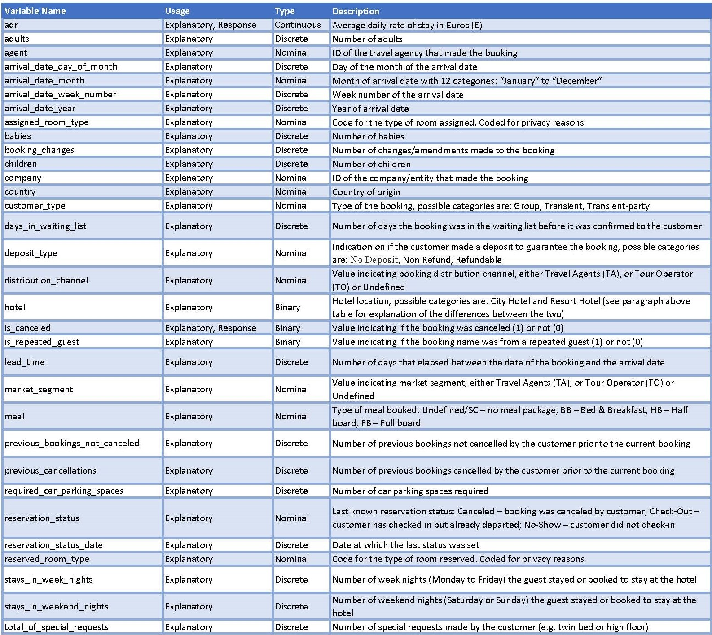

```{r setup, include=FALSE}
knitr::opts_chunk$set(echo = TRUE)
knitr::opts_chunk$set(dev = 'pdf')

```

# Introduction & Background

In 2019, tourism and travel brought in 42.8 billion USD to Portugal [1], contributing to 19.8% of GDP [2]. The rich culture, sunny beaches, and traditional food, all offered at affordable prices, explain the high amount of money coming into the country. Following the 2008 financial crisis, Portugal was hit especially hard. Considering that tourism is such an important part of the economy, being able to maximize efficiency of hospitality management would be beneficial.  

Consistency is an important factor in the hospitality industry. The behavior of clients can be chaotic, leading to cancellations, shortened stays, a desire for more expensive accommodations, and many other factors. The rise of data science has enabled businesses to utilize historical client data to create profiles in attempts to maximize profits and minimize liabilities.  

While guests make bookings in advance for hotels, often they cancel their reservation prior to their stay. Being able to predict a guest's behavior in advance of their stay is an asset for the management team. Creating a profile for customers based on historical client data has enabled businesses to create profiles to maximize profits while minimizing liabilities. 

 

# Dataset Description

The dataset used for this report is the 'Hotel Booking Demand Dataset' acquired from Kaggle [3], the dataset originated from ScienceDirect [4], authored by Nuno Antonio, Ana de Almeida, Luis Nunes. It consists of hotel demand data from two hotels in Portugal from July 2015 to August 2017, with one hotel located in an urban region (Lisbon) classed in the dataset as ‘City Hotel’, and another located in a resort region (Algarve) classed ‘Resort Hotel’.

The dataset includes 119,390 data points, each data point representing a single hotel room booking. There are 32 variables total, containing both qualitative (binary and nominal) and quantitative variables (discrete and continuous). The details of each variable are listed in the table below in alphabetical order

```{r variable_table, out.width = '140%', echo = FALSE}
# 
```

\newpage
# Analysis and Results

## Research Questions

There are 3 research questions analyzed in this report:

1. Using contingency tables, can it be determined if there is independence between categorical variables?
2. Which model is the best at predicting hotel booking cancellation in Portugal between Logistic Regression, Classification Tree, Random Forest Analysis, and Linear/Quadratic Discriminant Analysis.
3. Using regression tree, which variables are important in predicting average daily rate of a hotel stay in Portugal?

In this part of the report, the research questions will be explored, showing the full steps taken in R in order to conduct the analyses, along with presenting detailed results.

## Data Import and Wrangling

Initially, the required packages were imported: 

```{r import_packages, warning=FALSE, message=FALSE}
### import packages
library('sampling') # sampling package
library('survey') # sample mean and sample SD functions
library('MASS') # package for lda and qda functions
library('car') # package for for VIF
library('klaR') # package for partimat (partition plot)
library('ggplot2') #using ggplot2 for data visualization
library('dplyr') # used for comparisons and filters
library('tree') # tree functions
library('caret') # train / createFolds function for cross validation
library('tidyverse')
library('GGally')
library('randomForest') # for RandomForest classification algorithm

# packages specific to research question 1
library(questionr)
library(fmsb)

# packages specific to research question 3
library('olsrr') # for stepwise
library('lmtest') # for Breusch-Pagan homoscedasticity test
library('nortest') # for Anderson-Darling normality test
```

The next step is to import the dataset into R from the raw CSV file from Kaggle

```{r import_dataset}
### import dataset
df=read.csv("hotel_bookings.csv",header=TRUE)

# check initial dataset dimensions
dim(df) 

# check column / variables. names
names(df)
```

Next, several steps are taken to properly wrangle the data, specifically:

1. replace 'NULL' in 'agent' column with 'None' (as NULL in this case means no agent was used)
2. replace 'NULL' in 'company' column with 'None' (as NULL in this case means no booking company was used)
3. replace 'Undefined' in 'meal' column with 'SC' (as they mean the same thing which is that no meal package was booked)
4. remove rows where 'children' column has 'NA' value (as they are unclean data)
5. remove rows where 'country' column has 'NULL' value (as they are unclean data)
6. remove rows where 'market_segment' column has 'Undefined' value (as they are unclean data)
7. remove rows where 'distribution_channel' column has 'Undefined' value (as they are unclean data)
8. factor our response variable "is_canceled" (as this makes the variable easier to work with later on in our analysis)
9. remove "stays_in_week_nights" and "stays_in_weekend_nights" = 0 (as they are unclean data)
10. removed data where "adult" and "children" = 0
11. added "consistent_room_type" column to the data to be used later in analysis
12. added "arrival_date_season" column to the data to be used later in analysis
13. duplicate the wrangled dataset for each group member, so that they can do their own problem specific wrangling without affecting other member's data

* There was an attempt to preserve as much data as possible in the wrangling
* Starting with 119,390 datapoints, 118,087 were left after cleaning/wrangling ( 1,303 datapoints removed in the process).

```{r data_wrangling}
### data cleaning
df1=df
# replace 'NULL' in 'agent' column with 'None'
df1$agent[df1$agent == 'NULL'] = 'None'

# replace 'NULL' in 'company' column with 'None'
df1$company[df1$company == 'NULL'] = 'None'

# replace 'Undefined' in 'meal' column with 'SC'
# data source states they are the same thing:
# https://www.sciencedirect.com/science/article/pii/S2352340918315191#tbl1fna
df1$meal[df1$meal == 'Undefined'] = 'SC'

# remove rows where 'children' column has 'NA' value
df1 = df1[!is.na(df1$children),]

# remove rows where 'country' column has 'NULL' value
df1 = df1[df1$country != 'NULL',]

# remove rows where 'market_segment' column has 'Undefined' value
df1 = df1[df1$market_segment != 'Undefined',]

# remove rows where 'distribution_channel' column has 'Undefined' value
df1 = df1[df1$distribution_channel != 'Undefined',]

# remove rows where 'market_segment' column has 'Undefined' value
df1 = df1[df1$market_segment != 'Undefined',]

# remove rows where "stays_in_week_nights" and "stays_in_weekend_nights" = 0
df1 = df1[df1$stays_in_week_nights > 0 | df1$stays_in_weekend_nights > 0,]

# removed rows where "adult" and "children" = 0
df1 = df1[df1$adults > 0 | df1$children > 0,]

# check cleaned dataset dimensions
dim(df1)

# factor our response variable "is_canceled" 
df1$is_canceled = factor(df1$is_canceled)

# check how many classes there are (the variable "Diabetes") 
unique(df1$is_canceled)

# check the class sizes. 
table(df1$is_canceled)

# Check how R dummifies the "is_canceled" variable
contrasts(df1$is_canceled)

# add consistent_room_type column to the data
df1$consistent_room_type = ifelse(df1$assigned_room_type == df1$reserved_room_type, 
                                  "Yes", "No")
# df1 = df1 %>% 
#  dplyr::select(-c(assigned_room_type, reserved_room_type))

# add arrival_date_season column to the data
df1$arrival_date_season = ifelse(df1$arrival_date_month %in% c("December", 
                                                               "January", 
                                                               "February"), 
                                 "Winter",
                                 ifelse(df1$arrival_date_month %in% c("March", 
                                                                      "April"), 
                                        "Spring",
                                 ifelse(df1$arrival_date_month %in% c("May", 
                                                                      "June", 
                                                                      "July", 
                                                                      "August"), 
                                        "Summer",
                                 "Fall")))

# reduce factors for agent
df1$agent_yn = ifelse(df1$agent=="None","No","Yes")

# reduce factors for company
df1$company_yn = ifelse(df1$company=="None","No","Yes")

# duplicate to specific datasets for each group member (so no accidents occur)
# Alex's dataset
dfAP = df1
# Radhika's dataset
dfRJ = df1
# Harold's dataset
dfHL = df1
# David's dataset
dfDSG = df1
# Daniel's dataset
dfDZ = df1
```


\newpage
## Research Question 1: Contingency tables- independence between categorical variables?

Creating contingency tables between categorical variables is a method to determine whether the response variable is independent from input variables. In this dataset, there are a number of categorical variables that can be compared to whether a booking is canceled. These include: "arrival_date_month","hotel","meal","country","market_segment","is_repeated_guest","previous_cancellations",and "deposit_type". First, contingency tables are outputted for each pair of variables, as well as residual tables and a Chi-squared test output for significance.

```{r contingency tables}
cont_vars=c("arrival_date_month","hotel","meal","country","market_segment","is_repeated_guest","previous_cancellations","deposit_type")
library(questionr)

# Create loop to make contingency tables for applicable variables


for (i in cont_vars){
  output= sprintf("Contingency table between cancellation and %s",i)
  print(output)
  tab<-table(dfAP$is_canceled,dfAP[[i]])
  #prop.table(tab)
  print(tab)
  print(chisq.test(tab))
  print(chisq.residuals(tab,std=TRUE))
}
```
All of the categorical variables are dependent on the response variable, "is_canceled". 

### Tests of $2\times 2$-contingency table

As "is_repeated_guest" and "hotel" are binomial variables, they can be compared to "is_canceled" to create 2x2-contingency tables.

```{r 2x2 contingency table testing- hotelxcancellation}

tab_hotel<-table(dfAP$is_canceled,dfAP$hotel)

no1=tab_hotel[1,1]
no2=tab_hotel[2,1]

tot1=no1+tab_hotel[1,2]
tot2=no2+tab_hotel[2,2]

riskdifference(no1,no2,tot1,tot2, conf.level = 0.95) 
riskratio(no1,no2,tot1,tot2)
oddsratio(as.matrix(tab_hotel), conf.level = 0.95, p.calc.by.independence = TRUE)
```

```{r 2x2 contingency table testing- repeated guestxcancellation}
tab_rep<-table(dfAP$is_canceled,dfAP$is_repeated_guest)

no1=tab_rep[1,1]
no2=tab_rep[2,1]

tot1=no1+tab_rep[1,2]
tot2=no2+tab_rep[2,2]

riskdifference(no1,no2,tot1,tot2, conf.level = 0.95) 
riskratio(no1,no2,tot1,tot2)
oddsratio(as.matrix(tab_rep), conf.level = 0.95, p.calc.by.independence = TRUE)
```

Performing the 2x2 contingency tests once again proves these variables to be dependent on the response variable.

\newpage
## Research Question 2: Which model is the best at predicting hotel booking cancellation in Portugal between Logistic Regression, Classification Tree, Random Forest Analysis, and Linear/Quadratic Discriminant Analysis.


### Logistic Regression

#### Data wrangling for Logistic Regression
```{r}
dfRJ = df %>% 
  dplyr::select(-c(reservation_status_date, reservation_status, company, previous_bookings_not_canceled, 
            country))

# Assuming that the "NULL" represents bookings made without an agent,
# we convert the variable 'agent' to a binary categorical variable 
# with 0 representing "NULL" and 1 representing valid agents. 
dfRJ$agent = ifelse(dfRJ$agent == "NULL", "yes", "no")

# Create a feature for consistent_room_type and drop assigned_room_type and reserved_room_type
dfRJ$consistent_room_type = ifelse(dfRJ$assigned_room_type == dfRJ$reserved_room_type, "yes", "no")
dfRJ = dfRJ %>% 
  dplyr::select(-c(assigned_room_type, reserved_room_type))

## Create arrival_date_season from month data and drop months
dfRJ$arrival_date_season = ifelse(dfRJ$arrival_date_month %in% c("December", "January", "February"), "Winter",
                                 ifelse(dfRJ$arrival_date_month %in% c("March", "April"), "Spring",
                                 ifelse(dfRJ$arrival_date_month %in% c("May", "June", "July", "August"), "Summer",
                                 "Fall")))

dfRJ = dfRJ %>% dplyr::select(-c(arrival_date_month))

# Convert year to factor
dfRJ$arrival_date_year = as.factor(dfRJ$arrival_date_year)

#convert all categorical variables to factors
dfRJ = dfRJ %>% mutate_if(is.character, as.factor)

# Check the observations in the levels of the market segment variable
# Drop levels if there are very few observations available.
table(dfRJ$market_segment)

# Drop the rows with undefined market segment
dfRJ = dfRJ[!dfRJ$market_segment == 'Undefined', ]

# Drop the rows with undefined distribution channel
dfRJ = dfRJ[!dfRJ$distribution_channel == 'Undefined', ]

# replace 'Undefined' in 'meal' column with 'SC'
# data source states they are the same thing:
# https://www.sciencedirect.com/science/article/pii/S2352340918315191#tbl1fna
dfRJ$meal[dfRJ$meal == 'Undefined'] = 'SC'

# remove rows where "stays_in_week_nights" and "stays_in_weekend_nights" = 0
dfRJ = dfRJ[dfRJ$stays_in_week_nights > 0 | dfRJ$stays_in_weekend_nights > 0,]

# removed rows where "adult" and "children" = 0
dfRJ = dfRJ[dfRJ$adults > 0 | dfRJ$children > 0,]

```


#### Check the distribution of the response variable. Convert it to a factor. 
```{r}
unique(dfRJ$is_canceled)
#png(file="./Images/plot1.png")
barplot(table(dfRJ$is_canceled), ylab= "Count",
        names.arg = c("0 - Not Canceled", "1 - Canceled"),
        col = c("darkblue", "firebrick"))
#dev.off()

```
The imbalance suggests that stratification ius required for creating train and test sets.

```{r}
set.seed(10)
NC = nrow(dfRJ[dfRJ$is_canceled == "0", ]); NC
C = nrow(dfRJ[dfRJ$is_canceled == "1", ]); C

Nh = c(NC, C)
N = nrow(dfRJ)
n = round(0.75*N)

idx = sampling:::strata(dfRJ, stratanames=c("is_canceled"), size=round(n*round(Nh/N, 1)), method="srswor")
train = dfRJ[idx$ID_unit, ]
test = dfRJ[-idx$ID_unit, ]
```

Examine the categorical variables for the maximum number of levels.
```{r}
train_cat = train %>% keep(is.factor)
str(train_cat)
```
#### Apply the logistic regression model

```{r}
logit_fit = glm(is_canceled~., family = binomial, data = train)
summary(logit_fit)
```
Check for multicollinearity in the logistic model coeficients. 

```{r}
library(car)
vif(logit_fit)
```

The VIF values are very high for market_segment and distribution_channel. One of the variables can be discarded. 
market_segment will be used in our model.

The features whose coefficients are *not* significantly different from zero will also be removed.
These include- 

- arrival_date_week_number  

- arrival_date_day_of_month

- required_car_parking_spaces

The p-value for the coefficient of the feature-"days_in_waiting_list" is not significant at $\alpha=0.05$, but very close to the significance level. Therefore, it will be kept in the model. 

```{r}
train2 = train %>% dplyr::select(-c(arrival_date_day_of_month, arrival_date_week_number, required_car_parking_spaces, distribution_channel))
```

```{r}
logit_fit2 = glm(is_canceled~., family = binomial, data = train2)
summary(logit_fit2)
```
Checking for multicollinearity again.
```{r}
vif(logit_fit2)
```
The VIF values are satisfactorily low for the all coefficients suggesting the absence of multicollinearity between the features in the model. 

Make predictions on the test set
```{r}
prob_predict = predict(logit_fit2, test, type="response")
cancel_predict = rep("0", nrow(test))
cancel_predict[prob_predict >= 0.5]= "1"
```

 Create confusion matrix for the model performance
```{r}
trueValues = test$is_canceled
confusion_mat = table(cancel_predict, trueValues)
cm = as.matrix(table(cancel_predict, trueValues)); cm
```

Heatmap for Confusion Matrix
```{r}
# Create dataframe for the confusion matrix
actual = as.data.frame(table(test$is_canceled))
names(actual) = c("Actual","ActualFreq")

# Build confusion matrix
hm_cm = as.data.frame(table(test$is_canceled, cancel_predict))
names(hm_cm) = c("Actual", "Predicted", "Freq")

#calculate percentage of test cases based on actual frequency
hm_cm = merge(hm_cm, actual, by=c("Actual"))
hm_cm$Percent = hm_cm$Freq/hm_cm$ActualFreq*100

#png(file="./Images/plot2.png", width=800, height=600)
tile <- ggplot() +
geom_tile(aes(x=Actual, y=Predicted,fill=Percent),data=hm_cm, color="black",size=0.1) +
labs(x="Actual",y="Predicted") + 
  scale_x_discrete(labels=c("0" = "Not canceled", "1" = "Canceled")) +
   scale_y_discrete(labels=c("0" = "Not canceled", "1" = "Canceled")) +
  theme(axis.text.y = element_text(face = "bold", size=18)) +
  theme(axis.text.x = element_text(face = "bold", size=18)) +
  theme(axis.title.x = element_text(face = "bold", size=18)) +
  theme(axis.title.y = element_text(face = "bold", size=18),
        legend.key.size = unit(1.5, 'cm'),
        legend.title = element_text(size=15), #change legend title font size
        legend.text = element_text(size=15)) 

tile = tile + 
geom_text(aes(x=Actual,y=Predicted, label=sprintf("%.1f", Percent)),data=hm_cm, size=8, colour="black") +
scale_fill_gradient(low="grey",high="red")

tile = tile + 
geom_tile(aes(x=Actual,y=Predicted),data=subset(hm_cm, as.character(Actual)==as.character(Predicted)), color="black",size=0.3, fill="black", alpha=0) 
 
#render
tile
#dev.off()
```
#### Metrics for Model Performance
Next, we calculate various metrics for validating the performnce of the logistic model. 

```{r}
n = sum(cm) # number of instances
nc = nrow(cm) # number of classes
diag = diag(cm) # number of correctly classified instances per class 
rowsums = apply(cm, 1, sum) # number of instances per class
colsums = apply(cm, 2, sum) # number of predictions per class
p = rowsums / n # distribution of instances over the actual classes
q = colsums / n # distribution of instances over the predicted classes
```

1. Sensitivity
```{r}
sens = cm[4]/sum(cm[2], cm[4])

print(paste0("Sensitivity = ", sens))
```

2. Accuracy
```{r}
accuracy=sum(diag)/n;
print(paste0("Accuracy = ", accuracy))
```

3. Per-class Precision, Recall, and F-1

```{r}
precision = diag / colsums 
recall = diag / rowsums 
f1 = 2 * precision * recall / (precision + recall) 

data.frame(precision, recall, f1)[2, ] 
```
4. Misclassification rate calculation
```{r}
#sum(confusion_mat[2:3])/nrow(test)
misclasRate = 1 - accuracy; 
print(paste0("Misclassification Rate = ", misclasRate))
```
#### Optimizing the threshold value using the ROC Curve
```{r}
library(ROCR)
```

Trying to find a threshold for the binary decision. 
```{r}
predicted <- predict(logit_fit2, newdata = train2, type="response")
```


ROC Curve 
```{r}
pred <- prediction(predicted, train2$is_canceled)
perf <- performance(pred, measure = "tpr", x.measure = "fpr")
#png(file="./Images/roc.png", width=400, height=300)
plot(perf, colorize=T, print.cutoffs.at=seq(0,1,by=0.1))
# dev.off()
```

Plot the accuracy of the model as a function of the threshold value.
```{r}
acc.perf = performance(pred, measure = "acc")
#png(file="./Images/roc2.png", width=400, height=300)
plot(acc.perf)
abline(v = 0.5, col="red", lwd=3, lty=2)
text(x=0.59, y=0.46, labels="0.5", pos=4, col="red")
arrows(x0=0.6, y0=0.45, x1=0.505, y1=0.38, col="black", lwd=1)
#dev.off()
```
The threshold of 0.5 gives the best accuracy in the model and shows a good tradeoff between the true and false positive rates. Therefore, the analyses continue with the selected threshold of 0.5.

#### Cross Validation 

```{r}
library(caret)
```

To perform stratified partition, the function "createFolds" is used from the package "caret".
```{r}
set.seed(10)
folds<-createFolds(factor(dfRJ$is_canceled), k=10)
```


```{r}
df_fold1 = dfRJ[folds$Fold01, ]
print(table(df_fold1$is_canceled))
```

Function to calculate the misclassification rate.
```{r}
library(MASS)

misclassification<-function(idx){
  Train<-dfRJ[-idx,]
  Test<-dfRJ[idx,]
  fit<-glm(is_canceled~., family = binomial, data = Train)
  prob_pred<-predict(fit,Test, type="response")
  cancel_predict = rep("0", nrow(Test))
  cancel_predict[prob_pred >= 0.5]= "1"
  return(1-mean(cancel_predict==Test$is_canceled))
}
```

Next, apply the function "lapply" to pass along a vector of indices to the function "misclassification".
```{r, warning=FALSE}
mis_rate=lapply(folds,misclassification)
mis_rate
```
Calculate the average misclassification error.
```{r}
mean(as.numeric(mis_rate))
```
#### Cross Validation for Feature Selection

Inspect the feature names
```{r}
names(train2)
```

Apply 10-fold cross-validation to measure the accuracy rate for models created with incremental addition of features to the base model with just 1 feature. 

```{r}
model_1 = train(factor(is_canceled)~hotel, data=dfRJ, trControl = trainControl(method = "CV", number=10), method='glm', family='binomial')
```

```{r}
model_2 = train(factor(is_canceled)~hotel+lead_time, data=dfRJ, trControl = trainControl(method = "CV", number=10), method='glm', family='binomial')
```

```{r}
model_3 = train(factor(is_canceled)~hotel+lead_time+arrival_date_year, data=dfRJ, trControl = trainControl(method = "CV", number=10), method='glm', family='binomial')
```

```{r, warning=FALSE}
model_4 = train(factor(is_canceled)~hotel+lead_time+arrival_date_year+stays_in_weekend_nights, data=dfRJ, trControl = trainControl(method = "CV", number=10), method='glm', family='binomial')
```

```{r, warning=FALSE}
model_5 = train(factor(is_canceled)~hotel+lead_time+arrival_date_year+stays_in_weekend_nights+stays_in_week_nights, data=dfRJ, trControl = trainControl(method = "CV", number=10), method='glm', family='binomial')
```

```{r, warning=FALSE}
model_6 = train(factor(is_canceled)~hotel+lead_time+arrival_date_year+stays_in_weekend_nights+stays_in_week_nights
                +adults, data=dfRJ, trControl = trainControl(method = "CV", number=10), method='glm', family='binomial')
```

```{r, warning=FALSE}
model_7 = train(factor(is_canceled)~hotel+lead_time+arrival_date_year+stays_in_weekend_nights+stays_in_week_nights
                +adults+children, data=dfRJ, trControl = trainControl(method = "CV", number=10), method='glm', family='binomial')
```

```{r, warning=FALSE}
model_8 = train(factor(is_canceled)~hotel+lead_time+arrival_date_year+stays_in_weekend_nights+stays_in_week_nights
                +adults+children+babies, data=dfRJ, trControl = trainControl(method = "CV", number=10), method='glm', family='binomial')
```

```{r, warning=FALSE}
model_9 = train(factor(is_canceled)~hotel+lead_time+arrival_date_year+stays_in_weekend_nights+stays_in_week_nights
                +adults+children+babies+meal, data=dfRJ, trControl = trainControl(method = "CV", number=10), method='glm', family='binomial')
```

```{r, warning=FALSE}
model_10 = train(factor(is_canceled)~hotel+lead_time+arrival_date_year+stays_in_weekend_nights+stays_in_week_nights
                +adults+children+babies+meal+market_segment, data=dfRJ, trControl = trainControl(method = "CV", number=10), method='glm', family='binomial')
```

```{r, warning=FALSE}
model_11 = train(factor(is_canceled)~hotel+lead_time+arrival_date_year+stays_in_weekend_nights+stays_in_week_nights
                +adults+children+babies+meal+market_segment+is_repeated_guest, data=dfRJ, trControl = trainControl(method = "CV", number=10), method='glm', family='binomial')
```

```{r, warning=FALSE}
model_12 = train(factor(is_canceled)~hotel+lead_time+arrival_date_year+stays_in_weekend_nights+stays_in_week_nights
                +adults+children+babies+meal+market_segment+is_repeated_guest+previous_cancellations, data=dfRJ, trControl = trainControl(method = "CV", number=10), method='glm', family='binomial')
```

```{r, warning=FALSE}
model_13 = train(factor(is_canceled)~hotel+lead_time+arrival_date_year+stays_in_weekend_nights+stays_in_week_nights
                +adults+children+babies+meal+market_segment+is_repeated_guest+previous_cancellations+
                  booking_changes, data=dfRJ, trControl = trainControl(method = "CV", number=10), method='glm', family='binomial')
```

```{r, warning=FALSE}
model_14 = train(factor(is_canceled)~hotel+lead_time+arrival_date_year+stays_in_weekend_nights+stays_in_week_nights
                +adults+children+babies+meal+market_segment+is_repeated_guest+previous_cancellations+
                  booking_changes+deposit_type, data=dfRJ, trControl = trainControl(method = "CV", number=10), method='glm', family='binomial')
```

```{r, warning=FALSE}
model_15 = train(factor(is_canceled)~hotel+lead_time+arrival_date_year+stays_in_weekend_nights+stays_in_week_nights
                +adults+children+babies+meal+market_segment+is_repeated_guest+previous_cancellations+
                  booking_changes+deposit_type+agent, data=dfRJ, trControl = trainControl(method = "CV", number=10), method='glm', family='binomial')
```

```{r, warning=FALSE}
model_16 = train(factor(is_canceled)~hotel+lead_time+arrival_date_year+stays_in_weekend_nights+stays_in_week_nights
                +adults+children+babies+meal+market_segment+is_repeated_guest+previous_cancellations+
                  booking_changes+deposit_type+agent+days_in_waiting_list, data=dfRJ, trControl = trainControl(method = "CV", number=10), method='glm', family='binomial')
```

```{r, warning=FALSE}
model_17 = train(factor(is_canceled)~hotel+lead_time+arrival_date_year+stays_in_weekend_nights+stays_in_week_nights
                +adults+children+babies+meal+market_segment+is_repeated_guest+previous_cancellations+
                  booking_changes+deposit_type+agent+days_in_waiting_list+customer_type, data=dfRJ, trControl = trainControl(method = "CV", number=10), method='glm', family='binomial')
```

```{r, warning=FALSE}
model_18 = train(factor(is_canceled)~hotel+lead_time+arrival_date_year+stays_in_weekend_nights+stays_in_week_nights
                +adults+children+babies+meal+market_segment+is_repeated_guest+previous_cancellations+
                  booking_changes+deposit_type+agent+days_in_waiting_list+customer_type+adr, data=dfRJ, trControl = trainControl(method = "CV", number=10), method='glm', family='binomial')
```

```{r, warning=FALSE}
model_19 = train(factor(is_canceled)~hotel+lead_time+arrival_date_year+stays_in_weekend_nights+stays_in_week_nights
                +adults+children+babies+meal+market_segment+is_repeated_guest+previous_cancellations+
                  booking_changes+deposit_type+agent+days_in_waiting_list+customer_type+adr+total_of_special_requests, data=dfRJ, trControl = trainControl(method = "CV", number=10), method='glm', family='binomial')
```

```{r, warning=FALSE}
model_20 = train(factor(is_canceled)~hotel+lead_time+arrival_date_year+stays_in_weekend_nights+stays_in_week_nights
                +adults+children+babies+meal+market_segment+is_repeated_guest+previous_cancellations+
                  booking_changes+deposit_type+agent+days_in_waiting_list+customer_type+adr+total_of_special_requests+
                  consistent_room_type, data=dfRJ, trControl = trainControl(method = "CV", number=10), method='glm', family='binomial')
```

```{r, warning=FALSE}
model_21 = train(factor(is_canceled)~hotel+lead_time+arrival_date_year+stays_in_weekend_nights+stays_in_week_nights
                +adults+children+babies+meal+market_segment+is_repeated_guest+previous_cancellations+
                  booking_changes+deposit_type+agent+days_in_waiting_list+customer_type+adr+total_of_special_requests+
                  consistent_room_type+arrival_date_season, data=dfRJ, trControl = trainControl(method = "CV", number=10), method='glm', family='binomial')
```

Calculate accuracy with all models
```{r}
accuracy = c(model_1$results[2], 
             model_2$results[2], 
             model_3$results[2], 
             model_4$results[2], 
             model_5$results[2], 
             model_6$results[2], 
             model_7$results[2], 
             model_8$results[2], 
             model_9$results[2], 
             model_10$results[2], 
             model_11$results[2], 
             model_12$results[2], 
             model_13$results[2], 
             model_14$results[2], 
             model_15$results[2], 
             model_16$results[2], 
             model_17$results[2], 
             model_18$results[2], 
             model_19$results[2], 
             model_20$results[2],
             model_21$results[2])

accuracy
```
Plot the accuracy rate against the number of features in the model.
```{r}
accuracy_df = data.frame(matrix(unlist(accuracy), nrow=length(accuracy), byrow=TRUE), seq(1,21, 1))
names(accuracy_df) = c("cv_accuracy", "features")
```

```{r}
ggplot(data=accuracy_df, aes(features, cv_accuracy)) + geom_point() + geom_line() +
  labs(x="Number of Features",
         y="Model Accuracy")
#ggsave("./Images/cvPlot.png")
```
The plot shows that the accuracy rate does not improve beyond the first 19 features in the model. Therefore, removing consistent_room_type and arrival_date_season from our final logistic regression model is optimal. 

### Final Model

```{r}
final_model = glm(factor(is_canceled)~hotel+lead_time+arrival_date_year+stays_in_weekend_nights+stays_in_week_nights
                +adults+children+babies+meal+market_segment+is_repeated_guest+previous_cancellations+
                  booking_changes+deposit_type+agent+days_in_waiting_list+customer_type+adr+total_of_special_requests, 
                data=train2,
                family = binomial)

summary(final_model)
```

Make predictions on the test set
```{r}
prob_predict = predict(final_model, test, type="response")
cancel_predict = rep("0", nrow(test))
cancel_predict[prob_predict >= 0.5]= "1"
logit_misrate = mean(test$is_canceled!=cancel_predict)*100
logit_misrate
```

```{r}
misclassification<-function(idx){
  Train<-dfRJ[-idx,]
  Test<-dfRJ[idx,]
  fit<-glm(factor(is_canceled)~hotel+lead_time+arrival_date_year+stays_in_weekend_nights+stays_in_week_nights
                +adults+children+babies+meal+market_segment+is_repeated_guest+previous_cancellations+
                  booking_changes+deposit_type+agent+days_in_waiting_list+customer_type+adr+total_of_special_requests, 
                data=Train,
                family = binomial)
  prob_pred<-predict(fit,Test, type="response")
  cancel_predict = rep("0", nrow(Test))
  cancel_predict[prob_pred >= 0.5]= "1"
  return(1-mean(cancel_predict==Test$is_canceled))
}
```

Next, apply the function "lapply" to pass along a vector of indices to the function "misclassification".
```{r, warning=FALSE}
mis_rate=lapply(folds,misclassification)
mis_rate
logit_cvmisrate=mean(as.numeric(mis_rate))*100
logit_cvmisrate
```

#### Final Model Interpretation

1. Features with a positive influence on predicting hotel booking cancellations:

- City Hotel

- Lead Time

- Arrival in the year 2017 compared with years 2015 and 2016

- No meal package

- Bookings made online

- Previous cancellations by the customer

- Transient Customer Type

- Average daily Rate

These features make it more likely for cancellations to occur.

2. Features with a negative influence:

- Resort Hotel

- Half-board meal package (breakfast and dinner)

- Complementary and corporate bookings; Group bookings; Bookings through travel agents and tour operators​

- Repeated guests

- Bookings Changes 

- Special Requests

These features make it less likely for cancellations to occur. 


### Classification Tree

First convert variables into factors:
```{r}
cols=c("is_canceled","arrival_date_year","is_repeated_guest","hotel","meal","reserved_room_type","assigned_room_type","deposit_type","customer_type","arrival_date_month","distribution_channel","market_segment","reservation_status","arrival_date_season","consistent_room_type")

dfHL[,cols]=lapply(dfHL[,cols], factor)
str(dfHL)
```

Train test splits of the data are created for all the models:
```{r}
set.seed(10)
NC = nrow(dfHL[dfHL$is_canceled == "0", ]); NC
C = nrow(dfHL[dfHL$is_canceled == "1", ]); C

Nh = c(NC, C)
N = nrow(dfHL)
n = round(0.75*N)

idx = sampling:::strata(dfHL, stratanames=c("is_canceled"), size=round(n*round(Nh/N, 1)), method="srswor")
trainHL=dfHL[idx$ID_unit, ]
testHL=dfHL[-idx$ID_unit, ]
```

10 fold cross validation for all models:
```{r}
folds<-createFolds(factor(dfHL$is_canceled), k=10)
```

Fit the data into a classification tree.

reservation_status is not included because it is too similar to the response variable.

Other variables not fitted:
reservation_status_date -is captured in arrival month and season
Country, agent, company -too many factors for R to handle
agent and company were simplified to Y/N
```{r}
hotel_ctree=tree(factor(is_canceled)~.,trainHL[,-c(31)])
summary(hotel_ctree)
```

```{r}
plot(hotel_ctree)
text(hotel_ctree, pretty=0)
```

Non-refund deposit type appears to be the most important factor.

```{r}
summary(dfHL[dfHL$deposit_type=="Non Refund",]$is_canceled)
```

However almost all bookings that are "Non Refund" were canceled. The result of the classification tree may be due to over fitting.

```{r}
summary(dfHL$is_canceled)
```

```{r}
14480/44115
```

Cancellations by Non Refund deposit type make up about 30% of all cancellations.

According to the data source (https://www.sciencedirect.com/science/article/pii/S2352340918315191)
"Non Refund" is described as "a deposit was made in the value of the total stay cost" and "If the payment was equal or exceeded the total cost of stay, the value is set as 'Non Refund'."

It does not explicitly specify that a deposit is not refundable in the conventional sense -only that a deposit of amount equal to or greater than the cost of stay was made.

If this fitted tree were pruned:

```{r}
set.seed(10)
cv.tree=cv.tree(hotel_ctree, FUN = prune.misclass)
plot(cv.tree$size,cv.tree$dev,type='b')
```

Two nodes result in the steepest decrease in misclassification rate.

```{r}
prune.tree=prune.tree(hotel_ctree,best=2)
plot(prune.tree)
text(prune.tree,pretty=0)
```

Resulting in deposit type as the only important factor in classifying whether a hotel booking gets canceled.

```{r}
summary(prune.tree)
```

```{r}
set.seed(10)
tree.pred<-predict(prune.tree,testHL,type = "class")
pred=tree.pred
actual=testHL$is_canceled
table(pred,actual)
mean(pred!=actual)
```

#### Deposit type removed
If deposit type causes over-fitting to the data, what does a fitted tree look like with deposit type removed?

```{r}
hotel_ctree=tree(factor(is_canceled)~.,trainHL[,-c(31,23)])
summary(hotel_ctree)
```


```{r}
plot(hotel_ctree)
text(hotel_ctree, pretty=0)
```

Lead time (days in advance a booking was made) becomes the first split.

```{r}
set.seed(10)
tree.pred<-predict(hotel_ctree,testHL,type = "class")
pred=tree.pred
actual=testHL$is_canceled
table(pred,actual)
mean(pred!=actual)
```

A validation misclassification rate of `r mean(pred!=actual)` is outputted.

Now we prune the tree:
```{r}
set.seed(10)
cv.tree=cv.tree(hotel_ctree, FUN = prune.misclass)
plot(cv.tree$size,cv.tree$dev,type='b')
```

Nodes beyond 6 give a marginal return to lowering misclassification rate.

```{r}
prune.tree=prune.tree(hotel_ctree,best=6)
plot(prune.tree)
text(prune.tree,pretty=0)
```

The above is the resulting pruned tree.
The classification decision is as follows:
1. If lead_time (days in advance booking was made) is less than 17.5 days: not canceled; else
2. More than one special request: not canceled; else
3. Guest got an inconsistent room type from their booking: not canceled; else
4. They've had at least one previous cancellation: canceled; else
5: The customer_type is Contract, Group, or Transient-Party: not canceled, else canceled.

```{r}
summary(prune.tree)
```

```{r}
set.seed(10)
tree.pred<-predict(prune.tree,testHL,type = "class")
pred=tree.pred
actual=testHL$is_canceled
table(pred,actual)
mean(pred!=actual)
classificationTreePrunedResult=mean(pred!=actual)
```

The pruned tree has a validation misclassification rate of `r mean(pred!=actual)`

#### Stratified 10 fold cross validation misclassification rate:

```{r}
mcrCTree<-function(idx){
  Train<-dfHL[-idx,-c(31,23)]
  Test<-dfHL[idx,-c(31,23)]
  fit<-tree(factor(is_canceled)~., Train)
  pred<-predict(fit,Test,type="class")
  return(1-mean(pred==Test$is_canceled))
}

mis_rate=lapply(folds,mcrCTree)
classificationTreeCVResult=mean(as.numeric(mis_rate))
```

The stratified 10 fold cross validation misclassification rate is `r classificationTreeCVResult`.

### Random Forest
 
Given the number of categorical variables and non-normally distributed numerical
variables in the dataset, an attempt at Random Forest learning as
a method to solve the classification problem is approached. \

```{r Isolate Variables Related to the Logistic Regression Model}

dfDSG <- dfDSG[c('is_canceled', 'hotel', 'lead_time', 'arrival_date_year',
                 'stays_in_weekend_nights', 'stays_in_week_nights', 'adults', 
                 'children', 'babies', 'meal', 'market_segment', 'is_repeated_guest',
                 'previous_cancellations', 'booking_changes', 'deposit_type',
                 'agent_yn', 'days_in_waiting_list', 'customer_type', 'adr',
                 'total_of_special_requests')] 
```

```{r Random Forest - Initial Analysis Run}

set.seed(10)
rf <- randomForest(factor(is_canceled)~hotel+lead_time+arrival_date_year+stays_in_weekend_nights+stays_in_week_nights
                +adults+children+babies+meal+market_segment+is_repeated_guest+previous_cancellations+
                  booking_changes+deposit_type+agent_yn+days_in_waiting_list+customer_type+adr+total_of_special_requests, 
                 data=dfDSG, 
                 ntree=200, 
                 proximity=FALSE)
rf

# Misclassification Rate
rf_va_misclss = 100*(rf$confusion[2,1]+rf$confusion[1,2])/(sum(rf$confusion[,2])+sum(rf$confusion[,1]))
rf_va_misclss
```

The misclassification rate for Random Forest through the standard approach is 
`r round(rf_va_misclss,2)`%.\


```{r Random Forest Error Plot}
# Plot Random Forest Error Rate 
oob.error.data <- data.frame(
     num_trees=rep(1:nrow(rf$err.rate), times=3),
     type=rep(c("OOB", "0", "1"), each=nrow(rf$err.rate)),
     error=c(rf$err.rate[,"OOB"],
             rf$err.rate[,"0"],  
             rf$err.rate[,"1"]))

ggplot(data=oob.error.data, aes(x=num_trees, y=error)) +  
  geom_line(aes(color=type)) + 
  ggtitle("Random Forest Error Rate by Number of Trees")+xlab("Number of Trees") + 
  ylab("Error Rate") + theme(legend.title = element_blank())
```

It can be seen from the above plot that the error rate levels off at about n=50 trees.\
There is also a significant gap between the error rate when predicting a cancellation
compared to predicting a non-cancellation. There is some laziness in this model where
it tends to have bias towards choosing non-cancellation.\

```{r Random Forest k-fold Cross-Validation}
set.seed(10)
n = 10

folds <- createFolds(factor(dfDSG$is_canceled), k=n)
trCtrl <- trainControl(index = folds, method = "cv", number = n)

rf_fit <- train(factor(is_canceled)~hotel+lead_time+arrival_date_year+stays_in_weekend_nights+stays_in_week_nights
                +adults+children+babies+meal+market_segment+is_repeated_guest+previous_cancellations+
                  booking_changes+deposit_type+agent_yn+days_in_waiting_list+customer_type+adr+total_of_special_requests, 
                 data=dfDSG,
                 trControl=trCtrl,
                 method="rf", metric='Accuracy')

rf_fit

# Misclassification Rate
rf_cv_misclss = 100*(1-max(rf_fit$results[,2]))
rf_cv_misclss
```

The misclassification rate for Random Forest k-Fold Cross Validation at k=10 is 
`r round(rf_cv_misclss,2)`%. 

### Linear Discriminant Analysis

To maintain consistency while analyzing models, the same variables 
used in the Logistic Regression Model are retained and the results are compared.\

However, there is a problem as many of the variables in the dataset are categorical
and therefore will not possess a normal distribution. Below is a breakdown of the
variables and their type:\

| Independent Variable      | Type                  |  
|---------------------------|-----------------------|
| hotel                     | Categorical, Binary   | 
| lead_time                 | int                   |
| arrival_date_year         | int (three 'classes') |
| stays_in_weekend_nights   | int                   |
| stays_in_week_nights      | int                   |
| adults                    | int                   |
| children                  | int                   |
| babies                    | int                   |
| meal                      | Categorical           |
| market_segment            | Categorical           |
| is_repeated_guest         | Categorical, Binary   |
| previous_cancellations    | int                   | 
| booking_changes           | int                   |
| deposit_type              | Categorical           |
| agent_yn                  | Categorical, Binary   |
| days_in_waiting_list      | int                   |
| customer_type             | Categorical           |
| adr                       | float                 |
| total_of_special_requests | int                   |

The distributions for those numerical variables are explored and
tested for their normality.\


Unfortunately multivariate normality tests in R will not work with the size of the dataset. Each of the eligible individual variables will be tested for normality at 
both classes of 'is_cancelled'. The sample size is too large for the Shapiro-Wilk
test, so the Anderson-Darling test is used instead.\

$H_{o}:$ The variable demonstrates a normal distribution.\
$H_{a}:$ The variable does not demonstrate a normal distribution.\

```{r Anderson-Darling Test for Numeric Dependant Variables}
numeric_col_vector <- colnames(dplyr::select_if(dfDSG, is.numeric))

for (i in numeric_col_vector){
  print(paste("Anderson Darling Test for Uncancelled Class, Variable:", i))
  print(ad.test(dfDSG[dfDSG$is_canceled == "0", i]))
  
  print(paste("Anderson Darling Test for Cancelled Class, Variable: ", i))
  print(ad.test(dfDSG[dfDSG$is_canceled == "1", i]))
}

```
```{r QQ-Plots,  fig.show="hold", out.width="50%"}
for (i in numeric_col_vector){
  qqnorm(dfDSG[dfDSG$is_canceled == "0", i], main=paste("Normal Q-Q Plot, Variable", i, "(Not Canceled)"))
  qqline(dfDSG[dfDSG$is_canceled == "0", i])
  qqnorm(dfDSG[dfDSG$is_canceled == "1", i], main=paste("Normal Q-Q Plot, Variable", i, "(Canceled)"))
  qqline(dfDSG[dfDSG$is_canceled == "1", i])
}
```
\
Based on the results of the Anderson-Darling test, the Null Hypothesis is rejected
for each numerical variable in the logistic regression model. None of the QQPlots
resemble a normal distribution.A log-transform is attempted where possible to see 
if that will generate a normal distribution.\

```{r Check of Number of Zeroes in each Numerical Variable}
numeric_col_vector <- colnames(dplyr::select_if(dfDSG, is.numeric))

for (i in numeric_col_vector){
  print(i)
  print(paste("% of Zeros in Variable: ", i, " For Uncancelled Class"))
  print(100*nrow(dfDSG[(dfDSG$is_canceled == "0") & (dfDSG[[i]] == 0), ])/nrow(dfDSG[(dfDSG$is_canceled == "0"),]))
  
  print(paste("% of Zeros in Variable: ", i, " For Cancelled Class"))
  print(100*nrow(dfDSG[(dfDSG$is_canceled == "1") & (dfDSG[[i]] == 0), ])/nrow(dfDSG[(dfDSG$is_canceled == "1"),]))
  
  print("")
}
```

The output above shows that there is a significant (> 5%) number of zeros 
present in 9 of the 11 variables. A check for normality of the log transform of
the two other variables, adr and adults is attempted.\

$H_{o}:$ The variable demonstrates a normal distribution.\
$H_{a}:$ The variable does not demonstrate a normal distribution.\

```{r Log-Transformed Anderson-Darling Test}
for (i in c("adults","adr")){
  print(paste("Anderson Darling Test for Log-Transform Uncancelled Class, Variable:", i))
  print(ad.test(log(dfDSG[(dfDSG$is_canceled == "0")&(dfDSG[[i]]>0), i])))
  
  print(paste("Anderson Darling Test for Log-Transform Cancelled Class, Variable: ", i))
  print(ad.test(log(dfDSG[(dfDSG$is_canceled == "1")&(dfDSG[[i]]>0), i])))
  print(" ")
}
```

Given the result of above, none of the individual variables come from a normal distribution
and therefore the assumption of multivariate normality fails. 

To test the equality of variance, the Levene's Test is used. 

$H_{o}:$ The variable demonstrates equal variance across classes.\
$H_{a}:$ The variable does not demonstrate equal variance across classes.\

```{r Levenes Test of Equal Variance}

for (i in numeric_col_vector){
  print(paste("Levene's Test for Variable:", i))
  print(leveneTest(dfDSG[,i]~is_canceled, dfDSG))
  print(" ")
}
```

From the results of the Levene Test it can be seen that only the variable 'children' satisfies the equal 
variance condition as it has a p-value greater than 0.05, where the null hypothesis fails to be rejected. The remaining variables do not demonstrate equal variance
across classes given that their p-values are << 0.05, and the null
hypothesis is rejected.\

The Fligner-Killeen test is put into place to see if any different results are achieved. 

$H_{o}:$ The variable demonstrates equal variance across classes.\
$H_{a}:$ The variable does not demonstrate equal variance across classes.\

```{r Fligner-Killeen Test of Equal Variance}

for (i in numeric_col_vector){
  print(paste("Fligner-Killen Test for Variable:", i))
  print(fligner.test(dfDSG[,i]~is_canceled, dfDSG))
  print(" ")
}
```

Again, it can be seen that the variable 'children' is the only numerical variable to have
a p-value greater than 0.05, and thus a failure to reject the null hypothesis. 
This forces the rejection of null hypothesis with the other variables.\

Given that the variable 'children' also did not pass the test previous for normality, 
there are no other variables from the Logistic Regression Model which are suitable
to use with a Linear Discriminant Analysis model.\

In any event, the creation and evaluation of the model to compare with
the other results in the knowledge that both assumptions have failed and the inferences
which can be made from both the LDA and QDA models are at best flawed.\

```{r Linear Discriminant Analysis Model - Validation Approach - Model Training}

set.seed(10)
NC = nrow(dfDSG[dfDSG$is_canceled == "0", ]);
C = nrow(dfDSG[dfDSG$is_canceled == "1", ]);

Nh = c(NC, C)
N = nrow(dfDSG)
n = round(0.75*N)

idx = sampling:::strata(dfDSG, stratanames=c("is_canceled"), size=round(n*round(Nh/N, 1)), method="srswor")
trainDSG = dfDSG[idx$ID_unit, ]
testDSG = dfDSG[-idx$ID_unit, ]

lda.fit <- lda(factor(is_canceled)~hotel+lead_time+arrival_date_year+
                 stays_in_weekend_nights+stays_in_week_nights+adults+children+
                 babies+meal+market_segment+is_repeated_guest+previous_cancellations+
                 booking_changes+deposit_type+agent_yn+days_in_waiting_list+customer_type+
                 adr+total_of_special_requests,
               data=trainDSG)

plot(lda.fit)
print(lda.fit)
```

Interpretation of results:\

1) According to the training data, 60% of bookings ended up being canceled.\
2) For each co-efficient used, the prediction tendency based on the training data is noted below:\

Note that the categorical variables have not been included due to their difficulty in
being interpreted given that their base factor is combined in the constant.\

| Independent Variable                      | Tendency                                                |  
|-------------------------------------------|---------------------------------------------------------|
| lead_time                                 | As ${\to \infty}$, more likely to be *cancelled*        |
| stays_in_weekend_nights                   | As ${\to \infty}$, more likely to be *not be cancelled* |
| stays_in_week_nights                      | As ${\to \infty}$, more likely to be *cancelled*        |
| adults                                    | As ${\to \infty}$, more likely to be *cancelled*        |
| children                                  | As ${\to \infty}$, more likely to be *cancelled*        |
| babies                                    | As ${\to \infty}$, more likely to be *not be cancelled* |
| is_repeated_guest                         | More likely to *not be cancelled*                       |
| previous_cancellations                    | As ${\to \infty}$, more likely to be *cancelled*        |
| booking_changes                           | As ${\to \infty}$, more likely to be *not be cancelled* |
| days_in_waiting_list                      | As ${\to \infty}$, more likely to be *cancelled*        |
| adr                                       | As ${\to \infty}$, more likely to be *cancelled*        |
| total_of_special_requests                 | As ${\to \infty}$, more likely to be *not be cancelled* |


```{r Linear Discriminant Analysis - Validation Approach - Model Testing}
lda.pred = predict(lda.fit, testDSG)
caret::confusionMatrix(lda.pred$class,testDSG$is_canceled)

# Misclassification Rate
lda_va_misclss = 100*(1-as.numeric(caret::confusionMatrix(lda.pred$class,testDSG$is_canceled)$overall[1]))
lda_va_misclss
```

The misclassification rate for LDA using the validation approach with a 
75/25 split is found to be `r round(lda_va_misclss, 2)`%.\

```{r Linear Discriminant Analysis - k-Fold Cross Validation}

n = 10

folds <- createFolds(factor(dfDSG$is_canceled), k=n)
trCtrl <- trainControl(index = folds, method = "cv", number = n)

set.seed(10)
lda_cv <- train(factor(is_canceled)~hotel+lead_time+arrival_date_year+stays_in_weekend_nights+stays_in_week_nights
                +adults+children+babies+meal+market_segment+is_repeated_guest+previous_cancellations+
                  booking_changes+deposit_type+agent_yn+days_in_waiting_list+customer_type+adr+total_of_special_requests, 
               data=dfDSG,
               trControl=trCtrl,
               method="lda")
               
lda_cv

# Misclassification Rate
lda_cv_misclss = 100*(1-as.numeric(lda_cv$results[2]))

```
The misclassification rate under k-fold Cross Validation at (k=10) for the Linear
Discriminant Analysis is `r round(lda_cv_misclss,2)`%.\

### Quadratic Discriminant Analysis

```{r Quadratic Discriminant Analysis - Validation Approach}
qda.fit <- qda(factor(is_canceled)~hotel+lead_time+arrival_date_year+stays_in_weekend_nights+stays_in_week_nights
                +adults+children+babies+meal+market_segment+is_repeated_guest+previous_cancellations+
                  booking_changes+deposit_type+agent_yn+days_in_waiting_list+customer_type+adr+total_of_special_requests, 
               data=trainDSG)

qda.class<-predict(qda.fit, testDSG)$class
caret::confusionMatrix(qda.class,
                       testDSG$is_canceled)

# Misclassification Rate
qda_va_misclss = 100*(1-as.numeric(caret::confusionMatrix(qda.class,testDSG$is_canceled)$overall[1]))
qda_va_misclss
```
The misclassification rate for QDA using the validation approach with a 
75/25 split is found to be `r round(qda_va_misclss, 2)`%.\

```{r Quadratic Discriminant Analysis - k-fold Cross Validation}
# Use folds from previous 
set.seed(10)

qda_cv <- train(factor(is_canceled)~hotel+lead_time+arrival_date_year+stays_in_weekend_nights+stays_in_week_nights
                +adults+children+babies+meal+market_segment+is_repeated_guest+previous_cancellations+
                  booking_changes+deposit_type+agent_yn+days_in_waiting_list+customer_type+adr+total_of_special_requests, 
               data=dfDSG,
               trControl=trCtrl,
               method="qda")
qda_cv

# Misclassification Rate
qda_cv_misclss = 100*(1-as.numeric(qda_cv$results[2]))
qda_cv_misclss
```

The misclassification rate under k-fold Cross Validation at (k=10) for the Quadratic
Discriminant Analysis is `r round(qda_cv_misclss,2)`%.\

\newpage
## Research Question 3: Using regression tree, which variables are important in predicting average daily rate of a hotel stay in Portugal?

The intent of this question is to determine which variables are important in predicting average daily rate of a hotel stay in Portugal. Specifically, which variables affect the price paid per day to stay at a hotel. Since the response variable, "average daily rate", is a continuous variable, the learning of regression tree is applied here, and compared to the results of both the pruned and unpruned tree. The learning of validation set approach is applied for cross validation, planning to use 75% of data for training, 25% for testing.

Starting off, some additional wrangling on variables is performed to be used in this analysis.

```{r q3_data_wrangling}
# convert date values from string to date type
dfDZ$reservation_status_date = as.Date(dfDZ$reservation_status_date, "%Y-%m-%d")

# factor all vategorical variables
dfDZ$hotel = factor(dfDZ$hotel)
dfDZ$arrival_date_month = factor(dfDZ$arrival_date_month)
dfDZ$meal = factor(dfDZ$meal)
dfDZ$country = factor(dfDZ$country)
dfDZ$market_segment = factor(dfDZ$market_segment)
dfDZ$distribution_channel = factor(dfDZ$distribution_channel)
dfDZ$is_repeated_guest = factor(dfDZ$is_repeated_guest)
dfDZ$reserved_room_type = factor(dfDZ$reserved_room_type)
dfDZ$assigned_room_type = factor(dfDZ$assigned_room_type)
dfDZ$deposit_type = factor(dfDZ$deposit_type)
dfDZ$agent = factor(dfDZ$agent)
dfDZ$company = factor(dfDZ$company)
dfDZ$customer_type = factor(dfDZ$customer_type)
dfDZ$reservation_status = factor(dfDZ$reservation_status)

dfDZ$consistent_room_type = factor(dfDZ$consistent_room_type)
dfDZ$arrival_date_season = factor(dfDZ$arrival_date_season)
```

The sample function is used to split out sets to be used for cross validation (75% training, 25% testing).

A regression tree is used using the tree() function with "average daily rate" as the response. The predictors are all other variable that are either quantitative or categorical that has less than 32 levels (due to constraints with tree() function, categorical variables with more than 32 levels are unable to be used).

```{r regression_tree_build}
# using regression tree to predict ADR
set.seed(10)
# split dataset: 75% training, 25% testing
idx=sample(1:nrow(dfDZ),3/4*nrow(dfDZ))
train=dfDZ[idx,]
test=dfDZ[-idx,]
# tree with every variable that has a factor of less than 32 
# because we cant have more than 32 levels for factor for the tree function
# so the variables taken out are: country, agent, company, reservation status date
tree.adr<-tree(adr~hotel+is_canceled+lead_time+arrival_date_year+arrival_date_month
               +arrival_date_week_number+arrival_date_day_of_month
               +stays_in_weekend_nights+stays_in_week_nights+adults+children+babies
               +meal+market_segment+distribution_channel+is_repeated_guest
               +previous_cancellations+previous_bookings_not_canceled
               +reserved_room_type+assigned_room_type+booking_changes+deposit_type
               +days_in_waiting_list+customer_type
               +required_car_parking_spaces+total_of_special_requests
               +reservation_status+consistent_room_type+arrival_date_season
               , train)
summary(tree.adr)
```
 [1] "hotel"                          "is_canceled"                    "lead_time"                      "arrival_date_year"             
 [5] "arrival_date_month"             "arrival_date_week_number"       "arrival_date_day_of_month"      "stays_in_weekend_nights"       
 [9] "stays_in_week_nights"           "adults"                         "children"                       "babies"                        
[13] "meal"                           "country"                        "market_segment"                 "distribution_channel"          
[17] "is_repeated_guest"              "previous_cancellations"         "previous_bookings_not_canceled" "reserved_room_type"            
[21] "assigned_room_type"             "booking_changes"                "deposit_type"                   "agent"                         
[25] "company"                        "days_in_waiting_list"           "customer_type"                  "adr"                           
[29] "required_car_parking_spaces"    "total_of_special_requests"      "reservation_status"             "reservation_status_date"      

Plot the tree and check the cross-validation error.

```{r regression_tree_plot}
# plot tree
plot(tree.adr)
text(tree.adr, cex = 0.55, pretty=0)

# Apply the tree to the test set, calculate RMSE
adr_hat<-predict(tree.adr,test)
plot(adr_hat,test$adr)
abline(0,1)
sqrt(mean((adr_hat-test$adr)^2)) #the mean squared error
```

The un-pruned tree cross-validation error is: RMSE = €33.89, This is interpreted as the standard deviation of the unexplained variance by the model. \

To answer the research question of which variables are important in predicting average daily rate of a hotel stay in Portugal, the tree shows that these are the 4 variables identified in our tree:

1. Arrival Month - Warmer months (May to September, especially July to August) lead to higher average daily rate.
2. Hotel - Hotel in resort region is cheaper than hotel in the city in colder months.
3. Market Segment - Market segment pays a major role in pricing, with Direct Booking and Online Travel Agents resulting in more expensive rates as compared to corporate and groups.
4. Meal Plan - Meal plans contributes to higher prices, with no meal/breakfast cheaper than Half/Full Board
5. Reserved Room Type - This variable is coded for privacy reasons, so we can not make any conclusions here, but we can conclude that certain room types are cheaper than others. A possible educated guess is that the smoking rooms / standard rooms are cheaper comparatively, but we have no evidence to back that up due to the data censoring in the original dataset.

Next, the pruning of the tree is explored. first CV error vs size of tree is plotted.

```{r regression_tree_cv_error_vs_nodes}
# tree pruning based on cross validation error

# check cross-valiation error and the size of the tree, 
# select the "best" number of terminal nodes
cv.adr=cv.tree(tree.adr)
plot(cv.adr$size,cv.adr$dev,type='b', cex = 2)
```

It can be seen that the cross-validation error is smallest at 10 terminal nodes, but improvement seemed to plateau at 7 terminal nodes. Thus, the tree will be pruned to 7 terminal nodes for a simpler model.

```{r regression_tree_prune}
# pick 7 terminal nodes, go ahead and prunned tree
prune.adr=prune.tree(tree.adr,best=7)
plot(prune.adr)
text(prune.adr, cex = 0.7, pretty=0)

# Apply the pruned tree to the test set, calculate RMSE
adr_hat<-predict(prune.adr,test)
plot(adr_hat,test$adr)
abline(0,1)
sqrt(mean((adr_hat-test$adr)^2))
```

The pruned tree cross-validation error is: RMSE = €34.96 (vs. the €33.89 of the un-pruned tree), slightly higher than the un-pruned tree \

By comparing the variables and branches to the un-pruned tree's, it can be seen that the pruned tree does not make use of the 'meal' (aka. meal plan) feature.\

For a comparison, a simple first order multiple linear regression model is built using methods learned in DATA603, using a validation set approach for cross validation. \

Here are the steps taken to build this simple first order multiple linear regression model:

1. Start with a full model with all variables, do ANOVA / f-test to check that at least one variable is significant.
2. Remove Aliased variables, in this case the variables we take out are 'arrival_date_season, which is an alias of 'arrival_date_month', and 'is_canceled', which is an alias of 'reservation_status'. Do ANOVA / f-test to check no significant variables are removed.
3. Use Stepwise regression (P_ent = 0.05, P_rem = 0.1) to reduce the full model, do ANOVA / f-test to check no significant variables are removed.
4. Check for multicollinearity and finalize model.
5. Check model assumptions, in our case they are linearity (using Residual vs Fitted), homoscedasticity (using Breusch-Pagan test), and normality (using Anderson-Darling test). Please see code comments below for our full write up of our Null Hypotheses and Alternative Hypotheses we used for these assumption checks.

Please note that many of the summary() outputs as well as some other functions such as alias() are commented out in order to cut down on the pages. The outputs are several pages long each due to the high number of factored variables in our model.

```{r simple_first_order_linear_regression}
# buiild linear regression model

# full model
fullmodel<-lm(adr~hotel+is_canceled+lead_time+arrival_date_year+arrival_date_month
        +arrival_date_week_number+arrival_date_day_of_month
        +stays_in_weekend_nights+stays_in_week_nights+adults+children+babies
        +meal+market_segment+distribution_channel+is_repeated_guest
        +previous_cancellations+previous_bookings_not_canceled
        +reserved_room_type+assigned_room_type+booking_changes+deposit_type
        +days_in_waiting_list+customer_type
        +required_car_parking_spaces+total_of_special_requests
        +reservation_status+consistent_room_type+arrival_date_season
        , data=train)
nomodel<-lm(adr~1, data = train)
# summary(fullmodel)

# check to see if at least one variable is significant
anova(nomodel, fullmodel)

# check for aliases
# alias(fullmodel)

# results not shown to save pages, as there were a lot of factored variables,
# but we reduce model based on alias result below:
# removed aliased variables "arrival_date_season"(an alias of arrival_date_month)
# removed aliased variables "is_canceled"(an alias of reservation_status)
reducedmodel<-lm(adr~hotel+lead_time+arrival_date_year+arrival_date_month
        +arrival_date_week_number+arrival_date_day_of_month
        +stays_in_weekend_nights+stays_in_week_nights+adults+children+babies
        +meal+market_segment+distribution_channel+is_repeated_guest
        +previous_cancellations+previous_bookings_not_canceled
        +reserved_room_type+assigned_room_type+booking_changes+deposit_type
        +days_in_waiting_list+customer_type
        +required_car_parking_spaces+total_of_special_requests
        +reservation_status+consistent_room_type
        , data=train)
# summary(reducedmodel)

# check to make sure no significant variables are removed
anova(reducedmodel, fullmodel)

# use stepwise regression to get a model
stepw=ols_step_both_p(reducedmodel,pent = 0.05, prem = 0.1, details=FALSE)
summary(stepw$model)
anova(stepw$model, fullmodel)

# check for multicolinearity
vif(stepw$model)
# we check for the GVIF corrected by the degrees of freedom: GVIF^(1/(2*Df))
# everything is close to or below 2
# so we conclude that there is a little multicollinearity but not significant

# set our final model = stepwise model
final_simple_lm<-lm(adr~arrival_date_year+arrival_date_month+adults+children
                  +meal+market_segment+distribution_channel
                  +reserved_room_type+assigned_room_type+customer_type
                  +total_of_special_requests+hotel+lead_time+deposit_type
                  +arrival_date_day_of_month+is_repeated_guest
                  +reservation_status+days_in_waiting_list
                  +required_car_parking_spaces+previous_cancellations
                  +consistent_room_type+booking_changes
                  +previous_bookings_not_canceled+stays_in_weekend_nights
                  +stays_in_week_nights
                  , data=train)
# summary(final_simple_lm)

# technically,we can do more to build a more complete model
# such as adding in interactions and higher order terms
# however, seeing as that's covered in data 603 and we already did that there,
# we will stop here to keep this report on topic and down to a reasonable length.

# Apply linear regression model to the test set, calculate RMSE
adr_hat<-predict(final_simple_lm,test)
rmse = sqrt(mean((adr_hat-test$adr)^2)) #the mean squared error
rmse

# Check our assumptions
# Linearity Assumption check
ggplot(final_simple_lm, aes(x=.fitted, y=.resid)) +
geom_point() +
geom_hline(yintercept = 0) +
geom_smooth()+
ylim(-500, 500)+
ggtitle("Residual plot: Residual vs Fitted values")

# Linearity Assumption Conclusion:
# The Residual vs. Fitted plot shows a curved line, 
# indicating that the linearity assumption is not met.

# Equal Variance Assumption Check
ggplot(final_simple_lm, aes(x=.fitted, y=sqrt(abs(.stdresid)))) +
geom_point() +
geom_hline(yintercept = 0) +
geom_smooth()+
ggtitle("Scale-Location plot : Standardized Residual vs Fitted values")

# Breusch-Pagan test (for equal variance)
# Ho: heteroscedasticity is not present (homoscedasticity)
# Ha: heteroscedasticity is present
bptest(final_simple_lm)

# Equal Variance Assumption Conclusion:
# The Residual vs. Fitted and Scale-Location plot both don't show any
# evidence of a pattern, hinting that the Equal Variance assumption is met.
# The Breusch-Pagan test returns a p-value = 0.9936 > alpha = 0.05,
# strongly concluding that the Equal Variance assumption is met.

# Check Normality Assumption - Anderson-Darling
# note that we would have used Shapiro wilk if possible, 
# but the sample size is >5000, so we can use that

#test normality with Anderson-Darling normality test for larger sample sizes
#Ho: the sample data are significantly normally distributed
#Ha: the sample data are not significantly normally distributed
ad.test(residuals(final_simple_lm))
# The Anderson-Darling test returns a p-value < alpha = 0.05,
# strongly concluding that the Equal Variance assumption is not met.
```
Simple first order linear regression model cross-validation error is: RMSE = €29.91, which is smaller than €34.96 (pruned tree) and €33.89 (un-pruned tree). The linear regression model also contains many more significant variables compared to the trees (25 total in the final linear model, vs. 5 in the un-pruned tree, and 4 in the pruned tree)\

However, at $\alpha = 0.05$, homoscedasticity assumption was met, but linearity and normality assumptions were not met. This suggests that a linear model may not be a good choice.


# Conclusion

The conclusions for each research question is as per below.

Research Question 1: Using contingency tables – the response variable _is_canceled_ is dependent on all categorical tested features.

Research Question 2: Random forest appears to be the best model for predicting booking cancellations with the lowest misclassification rate of `r round(rf_va_misclss,2)`% against the test data, and `r round(rf_cv_misclss,2)`% in cross-validation, below is a full table comparing the different models misclassification rates.

| Classification Method | Misclassification Rate using Validation Set Approach | Misclassification Rate using 10-fold Cross Validation |
|-----------------------|------------------------------------------------------|-------------------------------------------------------|
| Logistic Regression   | `r round(logit_misrate,2)` %                                               | `r round(logit_cvmisrate,2)` %                                                |
| Classification Tree   | `r round(classificationTreePrunedResult*100,2)` %             | `r round(classificationTreeCVResult*100,2)` %                  |
| Random Forest         | `r round(rf_va_misclss,2)`%                         |`r round(rf_cv_misclss,2)`%                          |
| LDA*                  | `r round(lda_va_misclss, 2)`%                        |`r round(lda_cv_misclss,2)`%                           |
| QDA*                  | `r round(qda_va_misclss, 2)`%                        |`r round(qda_cv_misclss,2)`%                           |

Research Question 3: Using regression tree, the variables shown to be important in predicting average daily rate of a hotel stay in Portugal are: Arrival Month, Hotel Type, Market Segment, and Meal Plan.

The report concludes that a relatively accurate model can be produced to a profile for a prospective client at a hotel in Portugal. Using historical client data, a hospitality management team may be able to predict whether a customer will cancel their stay with up to ___ % accuracy. This can be useful for a management team, as well as for future hospitality groups to formulate business models and customer planning.

\newpage
# References

[1] - __Total contribution of travel and tourism to the gross domestic product in Portugal in 2019 and 2020__ (Statista, 2021). Retrieved from https://www.statista.com/statistics/770057/travel-and-tourism-s-total-contribution-to-gdp-in-portugal/

[2] - __Portugal - Contribution of travel and tourism to GDP in constant prices of 2011__ (knoema, 2022). Retrieved February 16, 2022 from https://knoema.com/atlas/Portugal/topics/Tourism/Travel-and-Tourism-Total-Contribution-to-GDP/Real-contribution-of-travel-and-tourism-to-GDP

[3] - __Hotel booking demand__ (Kaggle, 2020). Retrieved February 18, 2022 from https://www.kaggle.com/jessemostipak/hotel-booking-demand

[4] - __Hotel booking demand datasets__ (ScienceDirect, 2018). Retrieved February 18, 2022 from https://www.sciencedirect.com/science/article/pii/S2352340918315191#bib5

